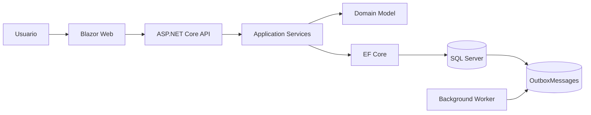

# Proyecto integrador del Módulo 1

## Nombre

Sistema de Gestión de Órdenes con Arquitectura .NET y SQL Server

## Objetivo

Construir una solución funcional que demuestre principios SOLID, patrones de diseño, documentación de APIs, persistencia SQL Server, comunicación asíncrona básica mediante Outbox, seguridad JWT e integración con frontend Blazor.

## Alcance mínimo

- API REST ASP.NET Core.
- Frontend Blazor.
- Base de datos SQL Server.
- Entidades: Product, Customer, Order, OrderItem, OutboxMessage.
- Swagger/OpenAPI documentado.
- Login simulado con JWT.
- Roles mínimos: Admin y Student/User.
- Patrón Outbox para eventos de orden creada.

## Entregables

```text
README.md
src/
database/
diagrams/
evidencias/
```

## Diagrama esperado



## Rúbrica

| Criterio | Ponderación |
|---|---:|
| Arquitectura y separación de responsabilidades | 25% |
| API y documentación OpenAPI | 20% |
| Persistencia SQL Server y modelo de datos | 20% |
| Seguridad JWT y autorización | 15% |
| Frontend Blazor e integración | 10% |
| Documentación y evidencias | 10% |
