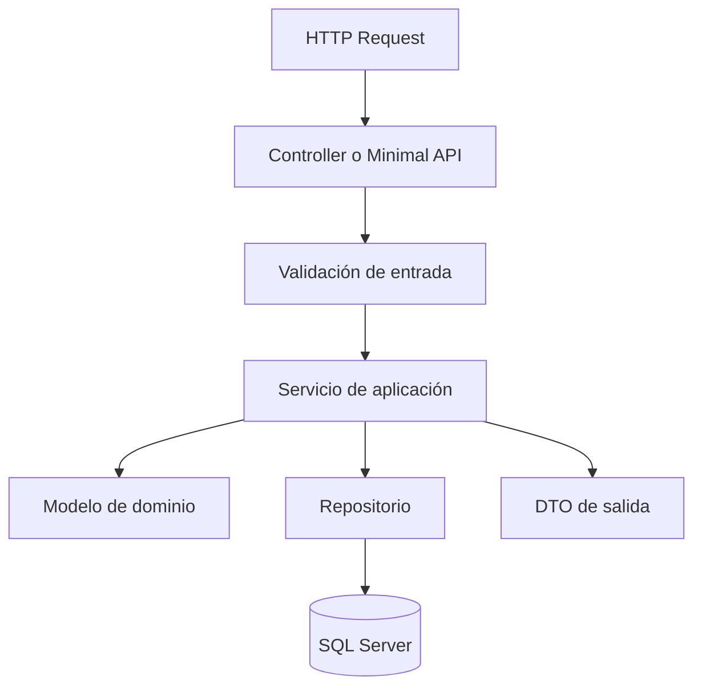

# Semana 1: Principios SOLID y Clean Code aplicado a entornos web

**Módulo:** 1  
**Bloque:** Diseño de Componentes y Limpieza de Código  
**Duración sincrónica:** 1h30  
**Carga total sugerida:** 7.5 horas semanales  
**Producto de la semana:** evidencia técnica en GitHub.

---

## 1. Resultado de aprendizaje

Al finalizar la semana, el estudiante será capaz de:

- Aplicar SRP, OCP, LSP, ISP y DIP en componentes web.
- Diferenciar código que funciona de código mantenible.
- Refactorizar servicios .NET con responsabilidades claras.

---

## 2. Contexto profesional


SOLID no es una lista decorativa de principios; es una herramienta para controlar el costo de cambio. En aplicaciones web, el cambio aparece en reglas de negocio, validaciones, contratos de API, persistencia y seguridad. Cuando un controlador contiene consultas SQL, validación, autorización, reglas de negocio y formateo de respuesta, el sistema queda acoplado a demasiados motivos de cambio.

Clean Code complementa SOLID porque se concentra en la legibilidad diaria: nombres claros, funciones pequeñas, errores explícitos y ausencia de duplicación accidental. Una clase limpia permite que otro desarrollador entienda el propósito sin reconstruir mentalmente toda la aplicación.

En .NET, SOLID se expresa de forma práctica mediante interfaces, servicios de aplicación, repositorios, DTOs, validadores y el contenedor de inyección de dependencias. El objetivo no es crear muchas capas por moda, sino separar decisiones que cambian a distinta velocidad.


---

## 3. Conceptos clave

- **Responsabilidad única**
- **Dependencia explícita**
- **Inyección de dependencias**
- **Nombres expresivos**
- **Validación en bordes del sistema**

---

## 4. Mapa visual del tema



---

## 5. Explicación detallada

### 5.1 Problema que resuelve el tema

En un entorno profesional, el valor de este tema aparece cuando el sistema necesita crecer sin perder control. El crecimiento puede ser técnico, como más tráfico, más módulos o más integraciones; o puede ser organizacional, como más personas modificando el código al mismo tiempo. Sin criterios de arquitectura, cada cambio aumenta el riesgo de romper funcionalidades existentes.

### 5.2 Decisión arquitectónica principal

La decisión central de esta semana consiste en identificar qué parte del sistema debe permanecer simple y qué parte necesita una estructura más formal. Una solución profesional no es la que usa más herramientas, sino la que reduce incertidumbre, facilita mantenimiento y permite operar el sistema con seguridad.

### 5.3 Señales de una mala implementación

- El código funciona, pero nadie puede explicar por qué está organizado de esa forma.
- Las responsabilidades están mezcladas entre interfaz, lógica, datos y seguridad.
- Los errores se ocultan o se manejan con respuestas genéricas.
- No existe documentación para ejecutar, probar o revisar la solución.
- La solución depende de pasos manuales que no están escritos.

### 5.4 Buenas prácticas esperadas

- Documentar las decisiones en el README.
- Mantener nombres claros y consistentes.
- Evitar secretos en código fuente.
- Usar Git con commits pequeños y descriptivos.
- Separar configuración por ambiente.
- Probar al menos el flujo principal.

---

## 6. Práctica técnica sugerida

Refactorizar un endpoint que crea órdenes separando Controller, DTO, Service, Repository y entidad de dominio. Usar SQL Server como persistencia, aunque al inicio puede simularse con una lista en memoria.

### Evidencia mínima de práctica

El estudiante debe incluir en su repositorio:

```text
/semana-01
├── README.md
├── src/
├── diagrams/
└── evidencias/
```

El README de la práctica debe explicar:

- Qué problema se resolvió.
- Cómo se diseñó la solución.
- Qué decisiones se tomaron.
- Cómo se ejecuta.
- Qué se aprendió.

---

## 7. Tarea semanal desde cero

Crear desde cero un módulo de productos aplicando SOLID. Debe incluir API, servicio de aplicación, interfaz de repositorio, implementación en memoria o SQL Server, README con diagrama y explicación de cada principio aplicado.

### Criterios de aceptación

- Repositorio en GitHub con historial de commits.
- README técnico con diagrama Mermaid o imagen exportada.
- Código o documento ejecutable/revisable según la naturaleza de la semana.
- Evidencia de pruebas, ejecución, diseño o análisis.
- Enlace compartido en Classroom mientras se habilita el sistema propio.

---

## 8. Preguntas de repaso

1. ¿Qué problema real resuelve el tema de esta semana?
2. ¿Qué riesgo aparece si se aplica incorrectamente?
3. ¿Qué alternativa más simple existe?
4. ¿Qué indicador usaría para saber si la solución funciona bien?
5. ¿Cómo explicaría esta decisión a un líder técnico o arquitecto?

---

## 9. Recursos adicionales

- https://learn.microsoft.com/aspnet/core/
- https://learn.microsoft.com/ef/core/
- https://learn.microsoft.com/dotnet/core/extensions/dependency-injection

---

## 10. Checklist de cierre

- [ ] Leí la teoría y entendí el mapa visual.
- [ ] Realicé la práctica o análisis sugerido.
- [ ] Documenté decisiones técnicas.
- [ ] Subí el trabajo a GitHub.
- [ ] Compartí el enlace en Classroom.
