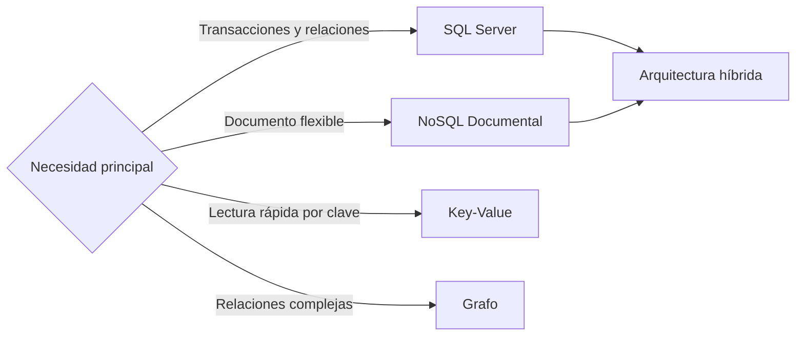

# Semana 6: Estrategias de Bases de Datos: SQL vs NoSQL y consistencia de datos

**Módulo:** 1  
**Bloque:** Comunicación y Seguridad del Sistema  
**Duración sincrónica:** 1h30  
**Carga total sugerida:** 7.5 horas semanales  
**Producto de la semana:** evidencia técnica en GitHub.

---

## 1. Resultado de aprendizaje

Al finalizar la semana, el estudiante será capaz de:

- Comparar SQL y NoSQL por modelo de acceso.
- Explicar ACID, BASE y consistencia eventual.
- Usar JSON en SQL Server para escenarios documentales simples.

---

## 2. Contexto profesional


La selección de base de datos no se define por moda, sino por patrones de consulta, consistencia requerida, volumen, velocidad de cambio del esquema y operación. SQL Server es fuerte cuando se requieren relaciones, transacciones, integridad referencial y consultas complejas. Las bases NoSQL suelen aportar flexibilidad de esquema, escalamiento horizontal o modelos especializados como documento, clave-valor, grafo o columna ancha.

En muchos sistemas reales se usa persistencia políglota: SQL para transacciones críticas y NoSQL para lectura flexible, caching, eventos o analítica. Para mantener este módulo simple, se trabaja principalmente con SQL Server y se muestra cómo almacenar estructuras JSON cuando existe una necesidad documental controlada.


---

## 3. Conceptos clave

- **Modelo relacional**
- **Documento**
- **Consistencia**
- **Normalización**
- **Desnormalización**
- **CAP**
- **JSON en SQL Server**

---

## 4. Mapa visual del tema



---

## 5. Explicación detallada

### 5.1 Problema que resuelve el tema

En un entorno profesional, el valor de este tema aparece cuando el sistema necesita crecer sin perder control. El crecimiento puede ser técnico, como más tráfico, más módulos o más integraciones; o puede ser organizacional, como más personas modificando el código al mismo tiempo. Sin criterios de arquitectura, cada cambio aumenta el riesgo de romper funcionalidades existentes.

### 5.2 Decisión arquitectónica principal

La decisión central de esta semana consiste en identificar qué parte del sistema debe permanecer simple y qué parte necesita una estructura más formal. Una solución profesional no es la que usa más herramientas, sino la que reduce incertidumbre, facilita mantenimiento y permite operar el sistema con seguridad.

### 5.3 Señales de una mala implementación

- El código funciona, pero nadie puede explicar por qué está organizado de esa forma.
- Las responsabilidades están mezcladas entre interfaz, lógica, datos y seguridad.
- Los errores se ocultan o se manejan con respuestas genéricas.
- No existe documentación para ejecutar, probar o revisar la solución.
- La solución depende de pasos manuales que no están escritos.

### 5.4 Buenas prácticas esperadas

- Documentar las decisiones en el README.
- Mantener nombres claros y consistentes.
- Evitar secretos en código fuente.
- Usar Git con commits pequeños y descriptivos.
- Separar configuración por ambiente.
- Probar al menos el flujo principal.

---

## 6. Práctica técnica sugerida

Modelar órdenes en tablas normalizadas y agregar una columna JSON para metadata flexible. Consultar datos con funciones JSON de SQL Server.

### Evidencia mínima de práctica

El estudiante debe incluir en su repositorio:

```text
/semana-06
├── README.md
├── src/
├── diagrams/
└── evidencias/
```

El README de la práctica debe explicar:

- Qué problema se resolvió.
- Cómo se diseñó la solución.
- Qué decisiones se tomaron.
- Cómo se ejecuta.
- Qué se aprendió.

---

## 7. Tarea semanal desde cero

Diseñar dos modelos para un catálogo: uno relacional y otro documental. Justificar cuál usaría en producción y bajo qué condiciones.

### Criterios de aceptación

- Repositorio en GitHub con historial de commits.
- README técnico con diagrama Mermaid o imagen exportada.
- Código o documento ejecutable/revisable según la naturaleza de la semana.
- Evidencia de pruebas, ejecución, diseño o análisis.
- Enlace compartido en Classroom mientras se habilita el sistema propio.

---

## 8. Preguntas de repaso

1. ¿Qué problema real resuelve el tema de esta semana?
2. ¿Qué riesgo aparece si se aplica incorrectamente?
3. ¿Qué alternativa más simple existe?
4. ¿Qué indicador usaría para saber si la solución funciona bien?
5. ¿Cómo explicaría esta decisión a un líder técnico o arquitecto?

---

## 9. Recursos adicionales

- https://learn.microsoft.com/sql/sql-server/
- https://learn.microsoft.com/sql/relational-databases/json/json-data-sql-server

---

## 10. Checklist de cierre

- [ ] Leí la teoría y entendí el mapa visual.
- [ ] Realicé la práctica o análisis sugerido.
- [ ] Documenté decisiones técnicas.
- [ ] Subí el trabajo a GitHub.
- [ ] Compartí el enlace en Classroom.
