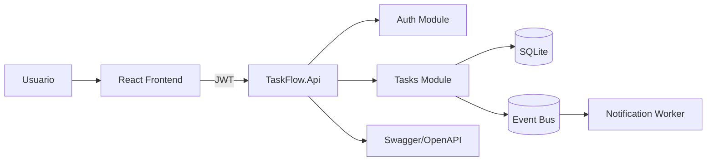

# Proyecto Integrador Módulo 1: TaskFlow Architecture

## Propósito

Construir una solución funcional que combine los conceptos trabajados durante las primeras 8 semanas:

- SOLID y Clean Code.
- Patrones de diseño.
- Monolito modular como punto de partida arquitectónico.
- API REST profesional documentada con Swagger/OpenAPI.
- Comunicación asíncrona mediante eventos.
- Persistencia SQL y análisis de alternativa NoSQL.
- Seguridad con JWT, roles y políticas.
- Frontend moderno consumiendo backend protegido.

---

## Caso de negocio

TaskFlow es una aplicación para gestionar tareas técnicas de un equipo de arquitectura y Cloud Ops. Cada usuario puede crear tareas, consultar sus tareas y marcarlas como completadas. El sistema debe estar preparado para crecer hacia módulos de proyectos, notificaciones, auditoría y reportes.

---

## Arquitectura objetivo



---

## Requisitos funcionales mínimos

1. Login demo con dos usuarios: `admin` y `student`.
2. Emisión de JWT.
3. Endpoint protegido para crear tareas.
4. Endpoint protegido para listar solo tareas del usuario autenticado.
5. Endpoint para completar tareas.
6. Persistencia en SQLite.
7. Publicación de evento `TaskCreatedEvent`.
8. Worker que consuma el evento y registre log.
9. Swagger habilitado.
10. Frontend que permita login, creación y listado de tareas.

---

## Requisitos técnicos

- Backend en ASP.NET Core.
- Frontend con React + Vite.
- Código separado por módulos.
- README técnico con:
  - Instrucciones de ejecución.
  - Diagrama Mermaid.
  - Endpoints.
  - Decisiones arquitectónicas.
  - Trade-offs.
- Evidencia de pruebas con JSON, capturas o archivo `.http`.

---

## Cómo ejecutar el backend

```bash
cd Modulo1/Semana8/src/backend/TaskFlow.Api
dotnet run
```

Abrir:

```text
http://localhost:5000/swagger
```

---

## Cómo ejecutar el frontend

```bash
cd Modulo1/Semana8/src/frontend/taskflow-web
npm install
npm run dev
```

---

## Usuarios demo

| Usuario | Password | Rol |
|---|---|---|
| admin | admin123 | Admin |
| student | student123 | User |

---

## Entrega final

El estudiante debe crear una carpeta propia:

```text
Modulo1/ProyectoIntegrador/entregas/<nombre-estudiante>/
```

Debe incluir:

- Código backend.
- Código frontend.
- README técnico.
- Diagrama de arquitectura.
- Evidencias.
- Reflexión final.

---

## Rúbrica

| Criterio | Peso |
|---|---:|
| Funcionalidad completa | 25% |
| Diseño arquitectónico y separación de responsabilidades | 25% |
| Seguridad JWT y autorización | 15% |
| Documentación Swagger/README | 15% |
| Frontend funcional | 10% |
| Evidencia y explicación de trade-offs | 10% |

---

## Extensiones opcionales

- Agregar módulo de proyectos.
- Agregar roles por equipo.
- Implementar refresh token.
- Reemplazar event bus en memoria por RabbitMQ.
- Agregar Dockerfile y docker-compose.
- Agregar pruebas unitarias.
- Agregar auditoría de cambios.
