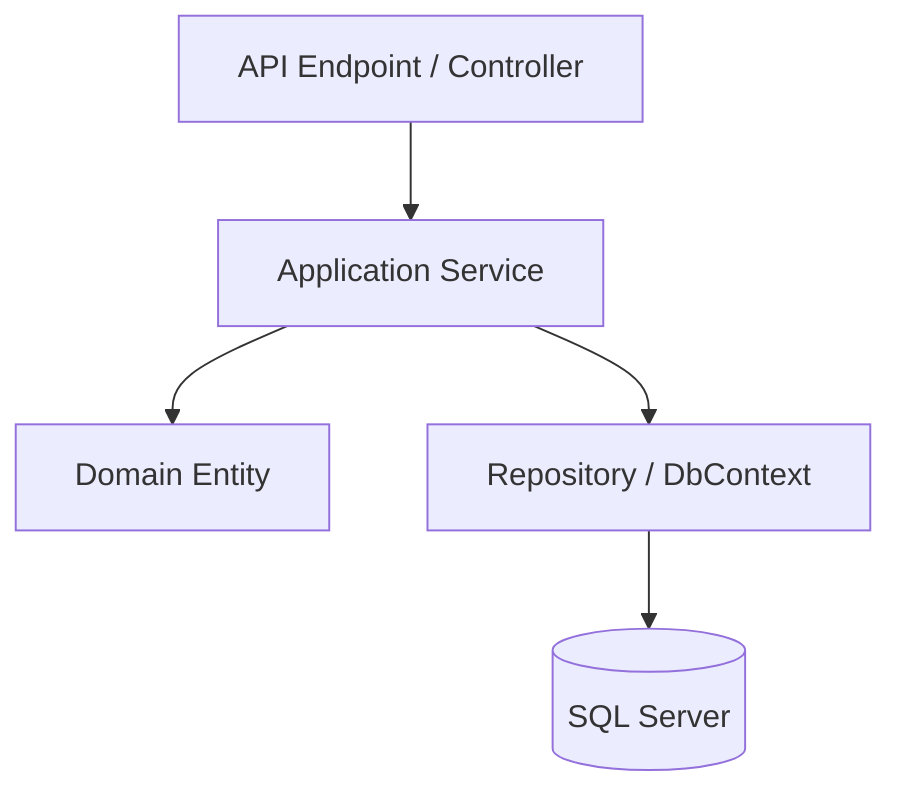

# Semana 1: Principios SOLID y Clean Code aplicados a entornos web

## Enfoque de la semana

Diseñar código backend mantenible en ASP.NET Core evitando controladores gigantes, servicios acoplados y modelos anémicos.


## 1. Mapa de aprendizaje

Esta semana introduce la base de todo el módulo: escribir software que pueda crecer sin volverse inmanejable.

El estudiante debe comprender que SOLID no es teoría aislada de orientación a objetos. En una aplicación web real, SOLID aparece cuando se decide:

- Qué debe ir en un endpoint.
- Qué debe ir en un servicio de aplicación.
- Qué reglas debe proteger una entidad.
- Qué detalles deben quedar en infraestructura.
- Qué dependencias deben ser interfaces.
- Qué partes del sistema deben poder cambiar sin afectar todo lo demás.

---

## 2. Explicación conceptual detallada

### 2.1 Clean Code en aplicaciones web

Clean Code significa que el código puede ser leído, entendido y modificado por otro desarrollador sin tener que reconstruir mentalmente todo el sistema.

En una API ASP.NET Core, el código deja de ser limpio cuando:

- El endpoint valida, calcula, consulta, transforma y guarda todo en el mismo método.
- El controlador conoce demasiados detalles de SQL Server.
- Los DTOs se usan como entidades de dominio.
- Las entidades solo tienen propiedades públicas y ninguna regla.
- Los servicios tienen nombres genéricos como `Manager`, `Helper` o `Processor`.
- Los métodos devuelven `null` sin explicar el error.
- Las excepciones se usan para flujos normales de negocio.

Un diseño limpio separa responsabilidades.

### 2.2 SOLID aplicado a .NET

#### Single Responsibility Principle

Una clase debe tener una razón principal para cambiar.

Ejemplo incorrecto:

```csharp
public class CourseController
{
    // Valida request
    // Calcula reglas
    // Abre conexión SQL
    // Envía correo
    // Genera token
}
```

Tiene demasiadas razones para cambiar: contrato HTTP, reglas de negocio, persistencia, notificaciones y seguridad.

Ejemplo correcto:

- `CourseEndpoints`: contrato HTTP.
- `CreateCourseUseCase`: caso de uso.
- `Course`: reglas del curso.
- `AcademyDbContext`: persistencia.
- `NotificationService`: comunicación externa.

#### Open/Closed Principle

El sistema debe permitir agregar comportamiento sin modificar código estable.

Ejemplo: si hoy se notifica por correo y mañana por SignalR, no se debe modificar todo el caso de uso. Se define una abstracción:

```csharp
public interface INotificationChannel
{
    Task SendAsync(Notification notification);
}
```

Luego se agregan implementaciones sin cambiar el caso de uso.

#### Liskov Substitution Principle

Una implementación debe poder reemplazar a otra sin romper expectativas.

Si `INotificationChannel` promete enviar notificaciones, una implementación no debería lanzar `NotSupportedException` para casos normales.

#### Interface Segregation Principle

No obligues a una clase a implementar métodos que no usa.

Mejor:

```csharp
public interface IReadCourses
{
    Task<Course?> GetByIdAsync(Guid id);
}

public interface IWriteCourses
{
    Task AddAsync(Course course);
}
```

Peor:

```csharp
public interface ICourseRepository
{
    Task AddAsync(Course course);
    Task DeleteAsync(Guid id);
    Task ExportToExcelAsync();
    Task SendEmailAsync();
}
```

#### Dependency Inversion Principle

Las capas de alto nivel no deben depender de detalles de bajo nivel.  
El caso de uso no debería depender de `SmtpClient`, `SqlConnection` o un API externo específico.

Debe depender de abstracciones.

---

## 3. Diagrama mental



---

## 4. Aplicación en .NET + SQL Server

En este módulo, Clean Code se aplica con las siguientes reglas:

| Elemento | Regla |
|---|---|
| Endpoint | Solo recibe, autentica, valida contrato y delega |
| Application Service | Orquesta el caso de uso |
| Entidad | Protege invariantes |
| DbContext | Representa persistencia |
| SQL Server | Protege integridad |
| DTO | No contiene reglas de negocio |

---

## 5. Ejemplo de problema real

Una plataforma académica necesita crear cursos.  
Una mala implementación permitiría:

- Crear cursos sin código.
- Repetir códigos.
- Publicar cursos incompletos.
- Guardar datos inconsistentes.
- Devolver errores improvisados.
- Enviar notificaciones dentro del controlador.

Una implementación profesional separa:

1. Validación de contrato.
2. Regla de negocio.
3. Persistencia.
4. Evento de dominio.
5. Notificación asíncrona.

---

## 6. Errores comunes

- Creer que SOLID significa crear muchas carpetas.
- Usar interfaces para todo sin necesidad.
- Confundir DTO con entidad.
- Hacer que EF Core determine todo el diseño.
- Poner lógica de negocio en Razor Components.
- Crear servicios gigantes con 20 métodos.
- Nombrar clases por tecnología y no por intención.

---

## 7. Práctica de refuerzo

Analizar las plantillas en `templates/`:

- `Before_CourseService.cs`
- `After_CourseEntity.cs`
- `After_CreateCourseUseCase.cs`

El objetivo es comparar una implementación acoplada contra una implementación separada por responsabilidades.

---

## 8. Tarea desde cero

Construir un pequeño módulo de estudiantes con:

- Entidad `Student`.
- Endpoint para crear estudiante.
- Validación de email.
- Restricción de email único en SQL Server.
- Servicio de aplicación `CreateStudentUseCase`.
- README explicando qué principio SOLID se aplicó en cada clase.

### Entregables

```text
entregas/semana-1/
├── README.md
├── src/
├── database/
└── diagrams/
```

### Preguntas obligatorias

1. ¿Qué responsabilidad tiene cada clase?
2. ¿Dónde está la regla de negocio más importante?
3. ¿Qué pasaría si mañana cambia SQL Server?
4. ¿Qué pasaría si mañana cambia el contrato HTTP?
5. ¿Qué parte del sistema quedó más fácil de probar?

---

## 9. Recursos adicionales

- Microsoft Learn — ASP.NET Core.
- Microsoft Learn — Entity Framework Core.
- Microsoft Learn — SQL Server LocalDB.
- Robert C. Martin — Clean Code.
- Robert C. Martin — Agile Software Development, Principles, Patterns, and Practices.


---

## Checklist de estudio

- [ ] Comprendí los conceptos principales.
- [ ] Revisé los diagramas.
- [ ] Leí las plantillas de código.
- [ ] Puedo explicar la decisión arquitectónica.
- [ ] Puedo implementar una variante desde cero.
- [ ] Registré al menos una decisión en formato ADR.
