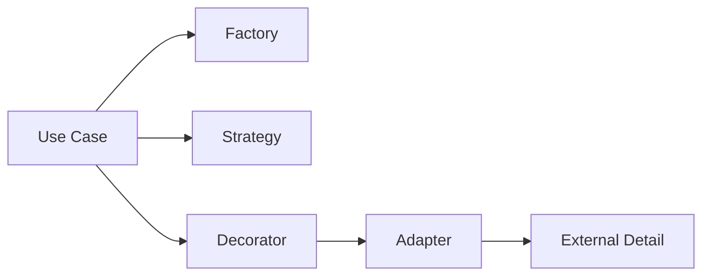

# Semana 2: Patrones de diseño esenciales: creacionales y estructurales

## Enfoque de la semana

Aplicar patrones útiles en .NET sin sobreingeniería.


## 1. Mapa de aprendizaje

Los patrones de diseño no son recetas para copiar. Son soluciones conocidas a problemas recurrentes.

Esta semana se enfoca en patrones que aparecen naturalmente en aplicaciones .NET:

- Factory.
- Strategy.
- Adapter.
- Decorator.
- Facade.

El estudiante debe aprender cuándo usar un patrón y, más importante aún, cuándo no usarlo.

---

## 2. Explicación conceptual detallada

### 2.1 Qué es un patrón de diseño

Un patrón de diseño es una forma reusable de resolver un problema de diseño. No es una librería ni un fragmento obligatorio de código. Es un lenguaje común para hablar de arquitectura.

Cuando un arquitecto dice “usemos un Adapter”, está diciendo:

> Tenemos una interfaz que nuestra aplicación entiende, pero existe un sistema externo con otra forma de comunicación. Crearemos una capa que traduzca entre ambos mundos.

### 2.2 Factory

Factory centraliza la creación de objetos cuando crear el objeto tiene reglas.

Mal uso:

```csharp
var service = new EmailService();
```

Esto acopla el código a una implementación concreta.

Uso razonable:

```csharp
var notification = NotificationFactory.CreateForCoursePublished(course);
```

Aquí la fábrica expresa intención de negocio.

### 2.3 Strategy

Strategy permite cambiar un algoritmo sin modificar el consumidor.

Ejemplo:

- Cálculo de descuento por estudiante.
- Cálculo de progreso de curso.
- Selección de canal de notificación.
- Política de evaluación.

El caso de uso no debe tener un `switch` enorme con todas las variantes.

### 2.4 Adapter

Adapter traduce entre el lenguaje de tu sistema y el lenguaje de otro sistema.

En este módulo no se usa un servicio externo real. Sin embargo, se simula un adaptador de notificaciones para que el estudiante entienda cómo se aisla infraestructura.

### 2.5 Decorator

Decorator agrega comportamiento sin modificar la clase original.

Ejemplo profesional:

- Logging.
- Métricas.
- Auditoría.
- Caché.
- Validación.
- Reintentos.

En .NET, los decoradores aparecen mucho alrededor de servicios de aplicación y repositorios.

### 2.6 Facade

Facade simplifica el acceso a un subsistema complejo.

Ejemplo:

```csharp
public interface IEnrollmentFacade
{
    Task EnrollStudentAsync(Guid studentId, Guid courseId);
}
```

Internamente puede validar estudiante, curso, cupo, pagos, notificaciones y auditoría.

---

## 3. Diagrama mental



---

## 4. Aplicación en .NET + SQL Server

Patrones usados en el módulo:

| Patrón | Uso en el curso |
|---|---|
| Factory | Crear notificaciones, eventos o entidades con intención |
| Strategy | Cambiar políticas de cálculo |
| Adapter | Aislar servicios externos o detalles de infraestructura |
| Decorator | Agregar logging/auditoría a servicios |
| Facade | Simplificar casos de uso complejos |

---

## 5. Señales de que necesitas un patrón

Usa un patrón cuando encuentres:

- Muchos `if` o `switch` por tipo de comportamiento.
- Código repetido alrededor de varios servicios.
- Dependencia directa de detalles externos.
- Creación de objetos compleja o duplicada.
- Un caso de uso que coordina demasiadas acciones.

No uses patrones solo para “verse profesional”.

---

## 6. Errores comunes

- Usar Abstract Factory para crear objetos simples.
- Crear Strategy cuando solo existe una variante.
- Llenar el proyecto de interfaces sin propósito.
- Hacer Adapter pero filtrar detalles externos al dominio.
- Crear Facades gigantes que terminan siendo otro monolito interno.

---

## 7. Práctica de refuerzo

Revisar las plantillas:

- `NotificationFactory.cs`
- `ProgressStrategy.cs`
- `AuditDecorator.cs`
- `ExternalNotificationAdapter.cs`

El objetivo es identificar qué problema resuelve cada patrón.

---

## 8. Tarea desde cero

Diseñar un sistema de evaluación académica con:

- Strategy para calcular nota final.
- Factory para crear evaluación según tipo.
- Decorator para registrar auditoría.
- SQL Server para guardar evaluaciones.
- README explicando por qué cada patrón fue necesario.

---

## 9. Recursos adicionales

- Refactoring Guru — Design Patterns.
- Microsoft Learn — Dependency injection in ASP.NET Core.
- Head First Design Patterns.
- Design Patterns: Elements of Reusable Object-Oriented Software.


---

## Checklist de estudio

- [ ] Comprendí los conceptos principales.
- [ ] Revisé los diagramas.
- [ ] Leí las plantillas de código.
- [ ] Puedo explicar la decisión arquitectónica.
- [ ] Puedo implementar una variante desde cero.
- [ ] Registré al menos una decisión en formato ADR.
