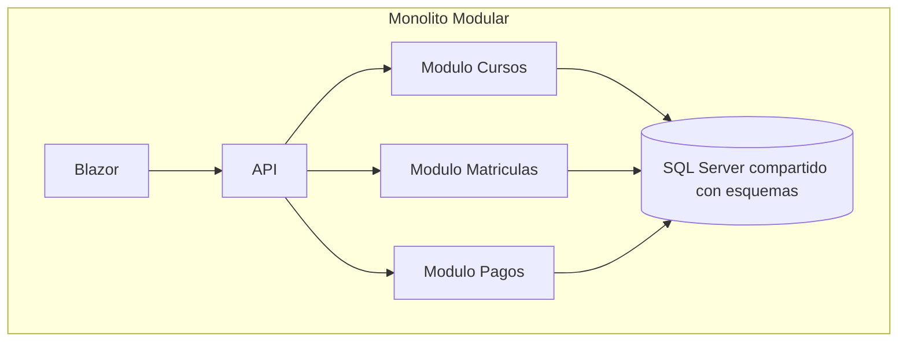

# Semana 3: Arquitectura monolítica vs microservicios

## Enfoque de la semana

Distinguir monolito tradicional, monolito modular y microservicios, usando criterios reales de decisión.


## 1. Mapa de aprendizaje

El objetivo de esta semana es evitar un error frecuente: pensar que microservicios siempre significa mejor arquitectura.

Un sistema puede fracasar por ser demasiado simple para sus necesidades, pero también puede fracasar por ser innecesariamente complejo.

---

## 2. Explicación conceptual detallada

### 2.1 Monolito tradicional

Un monolito tradicional es una aplicación desplegada como una sola unidad, donde las responsabilidades internas están mezcladas.

No todo monolito es malo. El problema aparece cuando:

- No hay límites internos.
- Todo módulo puede modificar cualquier tabla.
- Los controladores llaman directamente cualquier servicio.
- No existen reglas de dependencia.
- La base de datos se convierte en el único punto de integración.

### 2.2 Monolito modular

Un monolito modular sigue desplegándose como una sola aplicación, pero se divide internamente en módulos.

Ejemplo:

- Cursos.
- Estudiantes.
- Matrículas.
- Evaluaciones.
- Notificaciones.

Cada módulo tiene:

- Casos de uso propios.
- Entidades propias.
- Endpoints propios.
- Tablas propias, idealmente en esquemas separados.
- Reglas claras de dependencia.

Este será el enfoque principal del módulo porque permite aprender diseño de límites sin introducir complejidad operacional.

### 2.3 Microservicios

Microservicios son servicios pequeños y autónomos, cada uno desplegable de forma independiente.

Un microservicio profesional debería:

- Tener responsabilidad de negocio clara.
- Ser dueño de sus datos.
- Desplegarse de forma independiente.
- Comunicarse por contratos.
- Tolerar fallos parciales.
- Tener observabilidad.
- Tener estrategia DevOps madura.

Microservicios no son simplemente “varios proyectos .NET”.

### 2.4 Costo oculto de microservicios

Microservicios introducen:

- Latencia de red.
- Versionamiento de contratos.
- Observabilidad distribuida.
- Seguridad entre servicios.
- Consistencia eventual.
- Deployments independientes.
- Manejo de fallos parciales.
- Duplicación controlada de datos.
- Mayor exigencia de automatización.

Por eso, muchas organizaciones deberían iniciar con un monolito modular bien diseñado.

---

## 3. Diagrama mental



---

## 4. Matriz de decisión

| Pregunta | Monolito modular | Microservicios |
|---|---|---|
| ¿Equipo pequeño? | Sí | No ideal |
| ¿Dominio aún cambia mucho? | Sí | Riesgoso |
| ¿Necesidad de escalar partes por separado? | Limitado | Sí |
| ¿Deploy independiente por equipo? | No | Sí |
| ¿Observabilidad madura? | No necesaria al inicio | Obligatoria |
| ¿Base de datos por servicio? | No | Sí |
| ¿Tolerancia a consistencia eventual? | No siempre | Necesaria |

---

## 5. Aplicación en .NET + SQL Server

Durante este módulo se recomienda:

- Una solución .NET.
- Una API.
- Un frontend Blazor.
- Un SQL Server.
- Módulos internos separados por carpeta y esquema SQL.

Ejemplo:

```text
Features/
├── Courses/
├── Students/
├── Enrollments/
└── Notifications/
```

En SQL Server:

```text
academy.Courses
academy.Students
academy.Enrollments
academy.OutboxMessages
```

---

## 6. Errores comunes

- Dividir servicios por tabla.
- Crear microservicios sin CI/CD.
- Compartir una misma base entre microservicios y decir que son independientes.
- Usar HTTP interno para todo.
- No considerar transacciones distribuidas.
- Copiar arquitectura de empresas grandes sin tener sus problemas.

---

## 7. Práctica de refuerzo

Analizar la plantilla `ModularStructure.md` y proponer límites para una plataforma académica.

---

## 8. Tarea desde cero

Diseñar un monolito modular para un sistema de inventario académico:

- Módulo de equipos.
- Módulo de préstamos.
- Módulo de usuarios.
- Módulo de auditoría.

Debe incluir:

- Diagrama Mermaid.
- Esquemas SQL propuestos.
- Reglas de dependencia.
- ADR justificando por qué no se usan microservicios todavía.

---

## 9. Recursos adicionales

- Microsoft .NET Microservices Architecture Guide.
- Martin Fowler — Microservices.
- Sam Newman — Building Microservices.
- Simon Brown — Software Architecture for Developers.


---

## Checklist de estudio

- [ ] Comprendí los conceptos principales.
- [ ] Revisé los diagramas.
- [ ] Leí las plantillas de código.
- [ ] Puedo explicar la decisión arquitectónica.
- [ ] Puedo implementar una variante desde cero.
- [ ] Registré al menos una decisión en formato ADR.
