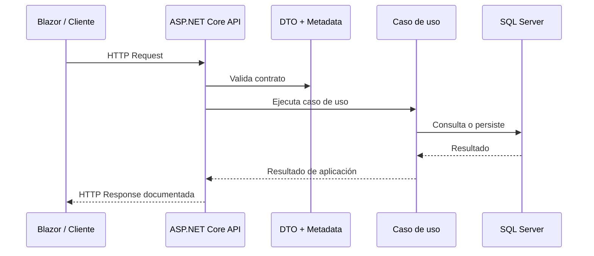

# Semana 4: Diseño y documentación de APIs profesionales con Swagger/OpenAPI

## Enfoque de la semana

Diseñar APIs mantenibles con contratos claros, errores consistentes, versionamiento conceptual y documentación útil.


## 1. Mapa de aprendizaje

Una API profesional no es solo un conjunto de endpoints que devuelven JSON.

Una API profesional tiene:

- Contratos explícitos.
- Nombres consistentes.
- Códigos HTTP correctos.
- Errores estandarizados.
- Seguridad declarada.
- Documentación OpenAPI.
- Versionamiento planificado.
- Separación entre DTO y entidad.
- Ejemplos claros para consumidores.

---

## 2. Explicación conceptual detallada

### 2.1 API como contrato

Cuando expones una API, estás publicando un contrato.  
Otros sistemas, frontends o equipos dependerán de ese contrato.

Cambiar una propiedad, eliminar un campo o modificar un código de respuesta puede romper consumidores.

Por eso una API se diseña, no se improvisa.

### 2.2 DTOs

Un DTO representa lo que viaja por HTTP.  
No debe confundirse con la entidad de dominio.

Entidad:

```csharp
public class Course
{
    public Guid Id { get; private set; }
    public string Code { get; private set; }
    public string Status { get; private set; }

    public void Publish() { ... }
}
```

DTO:

```csharp
public record CourseResponse(Guid Id, string Code, string Name, string Status);
```

El DTO no protege reglas de negocio. Solo transporta datos.

### 2.3 Códigos HTTP

| Código | Uso |
|---|---|
| 200 OK | Consulta exitosa |
| 201 Created | Recurso creado |
| 204 No Content | Operación exitosa sin cuerpo |
| 400 Bad Request | Request inválido |
| 401 Unauthorized | No autenticado |
| 403 Forbidden | Autenticado sin permisos |
| 404 Not Found | Recurso no existe |
| 409 Conflict | Conflicto de negocio |
| 500 Internal Server Error | Error inesperado |

### 2.4 Errores consistentes

Un error profesional debe responder:

- Qué pasó.
- Qué código interno lo identifica.
- Qué puede hacer el consumidor.
- Qué trazabilidad existe.

Ejemplo:

```json
{
  "code": "course_code_already_exists",
  "message": "Ya existe un curso con ese código.",
  "traceId": "00-abc..."
}
```

### 2.5 OpenAPI y Swagger

OpenAPI describe la API de forma estándar.  
Swagger UI permite explorarla visualmente.

La documentación debe ayudar a consumir la API. No debe ser solo un JSON generado automáticamente.

Debe incluir:

- Summary.
- Description.
- Tags.
- Responses.
- Security scheme.
- Ejemplos.
- Contratos claros.

---

## 3. Diagrama mental



---

## 4. Aplicación en .NET

ASP.NET Core permite documentar endpoints con metadata:

```csharp
app.MapPost("/api/courses", CreateCourse)
   .WithTags("Courses")
   .WithSummary("Crea un curso")
   .WithDescription("Registra un nuevo curso en estado Draft.");
```

En controladores se pueden usar atributos como:

```csharp
[ProducesResponseType(typeof(CourseResponse), StatusCodes.Status201Created)]
[ProducesResponseType(typeof(ProblemDetails), StatusCodes.Status409Conflict)]
```

---

## 5. Buen diseño de endpoints

| Operación | Endpoint recomendado |
|---|---|
| Listar cursos | GET /api/courses |
| Obtener curso | GET /api/courses/{id} |
| Crear curso | POST /api/courses |
| Actualizar curso | PUT /api/courses/{id} |
| Publicar curso | POST /api/courses/{id}/publish |
| Eliminar curso | DELETE /api/courses/{id} |

Evitar:

```text
/api/createCourse
/api/getAllCourses
/api/course/publishCourseNow
```

---

## 6. Errores comunes

- Exponer entidades EF directamente.
- Devolver siempre 200 aunque haya error.
- No documentar respuestas de error.
- Usar nombres inconsistentes.
- Mezclar comandos y consultas sin claridad.
- Cambiar contratos sin versionamiento.
- No proteger endpoints sensibles.

---

## 7. Práctica de refuerzo

Revisar:

- `CourseApiContract.cs`
- `ProblemDetailsExample.cs`
- `OpenApiEndpointMetadata.cs`

---

## 8. Tarea desde cero

Diseñar API para `Students`:

- GET /api/students
- GET /api/students/{id}
- POST /api/students
- PUT /api/students/{id}
- POST /api/students/{id}/activate

Debe incluir:

- DTOs separados.
- Códigos HTTP correctos.
- Errores consistentes.
- OpenAPI metadata.
- README con decisiones de contrato.

---

## 9. Recursos adicionales

- Microsoft Learn — ASP.NET Core OpenAPI.
- Microsoft Learn — Swagger / Swashbuckle / NSwag.
- Microsoft REST API Guidelines.
- OpenAPI Specification.


---

## Checklist de estudio

- [ ] Comprendí los conceptos principales.
- [ ] Revisé los diagramas.
- [ ] Leí las plantillas de código.
- [ ] Puedo explicar la decisión arquitectónica.
- [ ] Puedo implementar una variante desde cero.
- [ ] Registré al menos una decisión en formato ADR.
