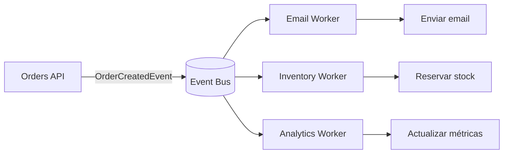

# Semana 5: Comunicación asíncrona y patrones de mensajería

> Módulo 1: Arquitectura de Software y Patrones  
> Duración de clase: **1h30**  
> Modalidad: **teoría visual + laboratorio guiado + tarea desde cero**

---

## 1. Objetivos de aprendizaje

- Comprender por qué la mensajería reduce acoplamiento temporal entre componentes.
- Diferenciar comandos, eventos, colas, pub/sub y event bus.
- Implementar un event bus en memoria con Channel y BackgroundService.
- Reconocer patrones como retry, dead-letter, idempotencia y outbox.

---

## 2. Agenda sugerida de la clase

| Tiempo | Actividad |
|---|---|
| 00:00 - 00:10 | Problema: sistemas que no deben bloquearse entre sí. |
| 00:10 - 00:35 | Teoría visual: eventos, comandos y consistencia eventual. |
| 00:35 - 01:15 | Laboratorio: API que publica eventos y worker que los consume. |
| 01:15 - 01:25 | Discusión: RabbitMQ, Azure Service Bus y outbox. |
| 01:25 - 01:30 | Tarea y criterios de entrega. |

---

## 3. Teoría resumida y didáctica

### Idea central

Esta semana se trabaja el tema **Comunicación asíncrona y patrones de mensajería** desde una perspectiva práctica. La meta no es memorizar definiciones, sino aprender a tomar decisiones técnicas justificadas y aplicarlas en código .NET.

### Explicación visual



### Mapa mental rápido

```text
Sincrónico:
Cliente espera -> API llama A -> API llama B -> API llama C

Asíncrono:
Cliente recibe 202/201 -> API publica evento -> consumidores procesan en segundo plano
```

### Conceptos clave

| Concepto | Explicación práctica | Error común |
|---|---|---|
| Responsabilidad | Cada componente debe tener una razón clara para cambiar. | Crear clases que validan, calculan, persisten y responden HTTP al mismo tiempo. |
| Acoplamiento | Grado de dependencia entre partes del sistema. | Consumir clases concretas en todas partes sin contratos. |
| Contrato | Acuerdo explícito entre componentes o sistemas. | Cambiar requests/responses sin documentarlo. |
| Trade-off | Costo técnico aceptado por una decisión. | Elegir una tecnología sin explicar qué se gana y qué se pierde. |

---

## 4. Laboratorio guiado: MessagingLab.Api con Event Bus en memoria

### Resultado esperado

Al final de la sesión, el estudiante tendrá una solución .NET funcional, documentada y lista para extender en la tarea.

### Comandos base

```bash
# Desde la raíz del repositorio
cd Modulo1/Semana5/src/MessagingLab.Api && dotnet run
```

### Paso 1: revisar la estructura

```text
src/
└── <Proyecto .NET>
    ├── Program.cs
    ├── *.csproj
    ├── Models/
    ├── Services/
    ├── Infrastructure/
    └── README interno opcional
```

Puntos para explicar en clase:

1. Qué responsabilidad tiene cada carpeta.
2. Qué clases pertenecen al dominio y cuáles son infraestructura.
3. Qué dependencias deberían apuntar hacia contratos y no hacia implementaciones.
4. Qué partes podrían reemplazarse sin afectar toda la solución.

### Paso 2: ejecutar la aplicación

```bash
cd Modulo1/Semana5/src/MessagingLab.Api && dotnet run
```

Si el proyecto es una API, abrir:

```text
http://localhost:5000
http://localhost:5000/swagger
```

> Si el puerto cambia, revisar la consola de `dotnet run`.

### Paso 3: probar los endpoints o ejecución

Usar `curl`, Postman, Insomnia o el archivo `.http` incluido cuando exista.

Ejemplo general:

```bash
curl http://localhost:5000/health
```

### Paso 4: identificar la decisión arquitectónica

Durante la clase, el estudiante debe responder:

- ¿Qué problema resuelve esta estructura?
- ¿Qué parte del código cambiaría si aparece un nuevo requisito?
- ¿Qué clase sería la primera en crecer peligrosamente?
- ¿Qué prueba manual demuestra que el flujo funciona?

### Paso 5: extender en vivo

Agregar una pequeña mejora durante la sesión:

- Nuevo endpoint.
- Nueva regla de negocio.
- Nueva implementación de una interfaz.
- Nueva validación.
- Nuevo caso de error documentado.

---

## 5. Checklist de laboratorio

- [ ] El proyecto compila.
- [ ] El estudiante puede explicar el flujo principal.
- [ ] Hay separación entre endpoint, lógica y persistencia.
- [ ] Hay al menos una prueba manual documentada.
- [ ] El README de la semana fue leído y usado durante la clase.
- [ ] La mejora en vivo quedó registrada en Git.

---

## 6. Tarea desde cero

### Enunciado

Crear desde cero un flujo de pagos donde PaymentCreated publique eventos para Email, Accounting y FraudCheck. Implementar idempotencia básica usando EventId.

### Requisitos mínimos

- Crear un nuevo proyecto independiente dentro de una carpeta `tarea/mi-solucion`.
- Usar nombres claros en clases, métodos y carpetas.
- Incluir README propio con:
  - Problema resuelto.
  - Diagrama Mermaid.
  - Instrucciones de ejecución.
  - Endpoints o ejemplos de uso.
  - Decisiones técnicas y trade-offs.
- Subir evidencia a GitHub.

### Criterios de aceptación

| Criterio | Esperado |
|---|---|
| Funcionalidad | La solución ejecuta y demuestra el flujo principal. |
| Diseño | Hay separación clara de responsabilidades. |
| Código | Métodos pequeños, nombres claros y validaciones básicas. |
| Documentación | README comprensible para otro desarrollador. |
| Evidencia | Incluye comandos, capturas o ejemplos JSON. |

---

## 7. Rúbrica sugerida

| Nivel | Descripción |
|---|---|
| Excelente | Implementa el flujo completo, justifica decisiones, documenta trade-offs y mantiene código limpio. |
| Bueno | Implementa el flujo principal con estructura clara y documentación suficiente. |
| En proceso | Funciona parcialmente, pero mezcla responsabilidades o tiene documentación incompleta. |
| Insuficiente | No ejecuta, no documenta o no evidencia comprensión del tema. |

---

## 8. Recursos adicionales

- [RabbitMQ .NET tutorial](https://www.rabbitmq.com/tutorials/tutorial-one-dotnet)
- [RabbitMQ .NET Client API Guide](https://www.rabbitmq.com/client-libraries/dotnet-api-guide)
- [Event Bus con RabbitMQ en .NET microservices](https://learn.microsoft.com/dotnet/architecture/microservices/multi-container-microservice-net-applications/rabbitmq-event-bus-development-test-environment)
- [Domain events en .NET microservices](https://learn.microsoft.com/dotnet/architecture/microservices/microservice-ddd-cqrs-patterns/domain-events-design-implementation)

---

## 9. Cierre de clase

Preguntas de reflexión:

1. ¿Qué decisión técnica tomada hoy reduce mantenimiento futuro?
2. ¿Qué parte del laboratorio sería riesgosa en producción?
3. ¿Qué métrica, prueba o evidencia usarías para demostrar que el diseño funciona?
