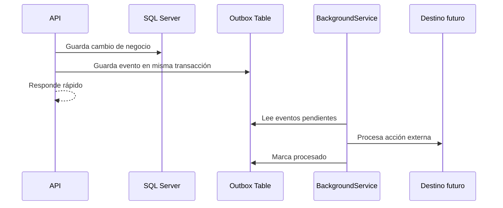

# Semana 5: Comunicación asíncrona y patrones de mensajería

## Enfoque de la semana

Entender mensajería sin introducir brokers externos: Outbox Pattern con SQL Server y BackgroundService.


## 1. Mapa de aprendizaje

La comunicación asíncrona permite desacoplar acciones que no tienen que ocurrir en la misma respuesta HTTP.

Ejemplo:

Cuando se crea un curso, quizá también se necesita:

- Notificar a instructores.
- Crear una entrada de auditoría.
- Actualizar un dashboard.
- Enviar un correo.
- Publicar un evento a otro sistema.

No todo debe ejecutarse dentro del request HTTP.

---

## 2. Explicación conceptual detallada

### 2.1 Comunicación sincrónica

En comunicación sincrónica, el cliente espera la respuesta.

```text
Cliente -> API -> SQL Server -> Respuesta
```

Es simple y útil cuando la operación debe completarse inmediatamente.

### 2.2 Comunicación asíncrona

En comunicación asíncrona, el sistema registra una intención o evento y lo procesa después.

```text
API -> Guarda evento -> Responde
Worker -> Procesa evento
```

Esto mejora resiliencia y reduce acoplamiento.

### 2.3 Problema de consistencia

Supongamos:

1. Guardas el curso en SQL Server.
2. Envías correo.
3. Falla el correo.

¿El curso debe revertirse?  
¿El usuario debe esperar?  
¿Debe reintentarse?

Ahora supongamos:

1. Envías correo.
2. Falla el guardado del curso.

Se notificó algo que no existe.

### 2.4 Outbox Pattern

Outbox resuelve este problema guardando el evento en la misma base y transacción que el cambio principal.

```text
Transacción:
- Insert Course
- Insert OutboxMessage
Commit
```

Luego un proceso separado lee Outbox y procesa mensajes pendientes.

### 2.5 Por qué usar SQL Server en este módulo

En sistemas reales se pueden usar brokers como RabbitMQ, Kafka o Azure Service Bus.  
Pero para este módulo se usa SQL Server porque:

- Reduce herramientas externas.
- Permite entender el patrón.
- Enseña consistencia transaccional.
- Es suficiente para aplicaciones pequeñas/medianas.
- Prepara al estudiante para migrar luego a brokers reales.

---

## 3. Diagrama mental



---

## 4. Diseño de tabla Outbox

```sql
CREATE TABLE academy.OutboxMessages
(
    Id UNIQUEIDENTIFIER NOT NULL PRIMARY KEY,
    Type NVARCHAR(250) NOT NULL,
    Payload NVARCHAR(MAX) NOT NULL,
    OccurredAt DATETIMEOFFSET NOT NULL,
    ProcessedAt DATETIMEOFFSET NULL,
    Error NVARCHAR(MAX) NULL
);
```

Campos clave:

| Campo | Propósito |
|---|---|
| Id | Identificador único del evento |
| Type | Tipo de evento |
| Payload | Datos serializados |
| OccurredAt | Momento de creación |
| ProcessedAt | Momento de procesamiento |
| Error | Último error ocurrido |

---

## 5. BackgroundService

ASP.NET Core permite crear procesos en segundo plano con `BackgroundService`.

En este módulo se usa para:

- Leer eventos pendientes.
- Procesarlos.
- Registrar errores.
- Marcar mensajes procesados.

---

## 6. Riesgos y mitigaciones

| Riesgo | Mitigación |
|---|---|
| Procesar dos veces | Diseñar consumidores idempotentes |
| Worker detenido | Procesar pendientes al reiniciar |
| Error permanente | Registrar error y revisar manualmente |
| Tabla muy grande | Archivado periódico |
| Payload incompatible | Versionar eventos |

---

## 7. Errores comunes

- Enviar correos dentro de la transacción principal.
- Borrar mensajes Outbox sin trazabilidad.
- No registrar errores.
- No pensar en idempotencia.
- Usar Outbox como cola infinita sin mantenimiento.
- Procesar eventos sin orden cuando el negocio exige orden.

---

## 8. Tarea desde cero

Crear Outbox para evento `StudentRegistered`.

Debe incluir:

- Tabla Outbox.
- Evento serializado.
- BackgroundService.
- Reintento simple.
- Campo `Attempts`.
- README explicando cómo se garantiza consistencia.

---

## 9. Recursos adicionales

- Microsoft Learn — Background tasks with hosted services.
- Enterprise Integration Patterns.
- Transactional Outbox Pattern.
- Microsoft Learn — SQL Server indexing.


---

## Checklist de estudio

- [ ] Comprendí los conceptos principales.
- [ ] Revisé los diagramas.
- [ ] Leí las plantillas de código.
- [ ] Puedo explicar la decisión arquitectónica.
- [ ] Puedo implementar una variante desde cero.
- [ ] Registré al menos una decisión en formato ADR.
