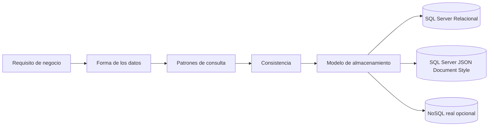

# Semana 6: Estrategias de bases de datos: SQL vs NoSQL

## Enfoque de la semana

Comprender cómo decidir entre modelos relacionales y documentales sin abandonar SQL Server en la práctica principal.


## 1. Mapa de aprendizaje

Esta semana enseña a tomar decisiones de datos.  
No se trata de defender SQL o NoSQL como religión técnica.

Se trata de responder:

- ¿Qué forma tienen mis datos?
- ¿Qué consultas necesito?
- ¿Qué consistencia requiere el negocio?
- ¿Qué relaciones son críticas?
- ¿Qué tan flexible debe ser el esquema?
- ¿Qué equipo dará soporte a la solución?

---

## 2. Explicación conceptual detallada

### 2.1 Modelo relacional

El modelo relacional organiza datos en tablas, filas, columnas y relaciones.

Es fuerte cuando necesitas:

- Integridad referencial.
- Transacciones.
- Consultas complejas.
- Reportes.
- Consistencia fuerte.
- Relaciones muchas-a-muchas.
- Constraints.
- Normalización.

Ejemplo académico:

- Student.
- Course.
- Enrollment.
- Assignment.
- Grade.

Estas entidades tienen relaciones claras.

### 2.2 Modelo NoSQL

NoSQL agrupa varias familias:

| Familia | Ejemplo conceptual |
|---|---|
| Documental | Documentos JSON |
| Key-value | Cache o configuración |
| Columnar | Analítica a gran escala |
| Grafo | Relaciones altamente conectadas |

NoSQL no significa “sin estructura”. Significa que no usa necesariamente el modelo relacional tradicional.

### 2.3 Documentos JSON

Un documento puede representar una estructura completa:

```json
{
  "studentId": "123",
  "name": "Ana",
  "preferences": {
    "language": "es",
    "notifications": true
  }
}
```

Esto es flexible, pero puede complicar:

- Validaciones.
- Reportes.
- Integridad entre documentos.
- Consultas relacionales.
- Actualizaciones parciales.
- Migraciones de estructura.

### 2.4 SQL Server y JSON

SQL Server permite almacenar y consultar JSON.  
Esto no convierte SQL Server en MongoDB, pero permite practicar escenarios híbridos.

Ejemplo:

```sql
CREATE TABLE academy.StudentProfiles
(
    StudentId UNIQUEIDENTIFIER NOT NULL PRIMARY KEY,
    ProfileJson NVARCHAR(MAX) NOT NULL,
    CONSTRAINT CK_StudentProfiles_IsJson CHECK (ISJSON(ProfileJson) = 1)
);
```

Ventaja: se mantiene SQL Server como única herramienta.  
Limitación: no reemplaza un motor documental real cuando el caso exige escalabilidad o patrones NoSQL avanzados.

---

## 3. Diagrama mental



---

## 4. Comparación práctica

| Criterio | SQL Server relacional | Documento JSON |
|---|---|---|
| Integridad referencial | Excelente | Limitada |
| Flexibilidad de estructura | Media | Alta |
| Reportes | Excelente | Más complejo |
| Transacciones | Excelente | Depende del motor |
| Cambios frecuentes de campos | Requiere migraciones | Más flexible |
| Consultas por relaciones | Natural | Más difícil |
| Auditoría | Muy buena | Depende del diseño |

---

## 5. Cuándo elegir SQL Server

Elige SQL Server cuando:

- Los datos tienen relaciones importantes.
- La consistencia es crítica.
- Hay reportes transaccionales.
- El equipo conoce SQL.
- Se requiere trazabilidad.
- Existen reglas de integridad fuertes.

### Ejemplo

Matrículas académicas:

- Un estudiante existe.
- Un curso existe.
- Una matrícula une ambos.
- No se debe matricular dos veces el mismo estudiante en el mismo curso.
- Debe existir una fecha.
- Debe existir estado.

Esto es naturalmente relacional.

---

## 6. Cuándo considerar NoSQL

Considera NoSQL cuando:

- El documento se lee y escribe como unidad.
- El esquema cambia frecuentemente.
- La estructura interna varía mucho por caso.
- No hay muchas relaciones fuertes.
- Se requiere escalabilidad específica.
- El caso se ajusta a una familia NoSQL clara.

### Ejemplo

Preferencias de usuario, configuración dinámica, formularios altamente variables.

---

## 7. Práctica de refuerzo

El módulo principal usa SQL Server y una tabla JSON para simular un escenario documental sin instalar otra base.

Archivos:

- `RelationalModel.sql`
- `JsonDocumentStyle.sql`
- `DecisionMatrix.md`

---

## 8. Tarea desde cero

Diseñar dos modelos para perfiles de estudiante:

1. Modelo relacional.
2. Modelo con JSON en SQL Server.

Debe entregar:

- Scripts SQL.
- Diagrama.
- Comparación.
- Decisión justificada.
- Riesgos de cada alternativa.

---

## 9. Sección opcional: NoSQL real

Si el instructor desea mostrar una base NoSQL real, puede hacerlo como demostración aislada.  
No debe convertirse en dependencia del proyecto integrador.

Opciones posibles:

- MongoDB local.
- Azure Cosmos DB Emulator.
- LiteDB como archivo local .NET.

La entrega principal del módulo debe seguir usando SQL Server.

---

## 10. Recursos adicionales

- Microsoft Learn — SQL Server JSON.
- Microsoft Learn — EF Core SQL Server provider.
- Designing Data-Intensive Applications.
- Microsoft Learn — Azure Cosmos DB conceptual documentation.


---

## Checklist de estudio

- [ ] Comprendí los conceptos principales.
- [ ] Revisé los diagramas.
- [ ] Leí las plantillas de código.
- [ ] Puedo explicar la decisión arquitectónica.
- [ ] Puedo implementar una variante desde cero.
- [ ] Registré al menos una decisión en formato ADR.
