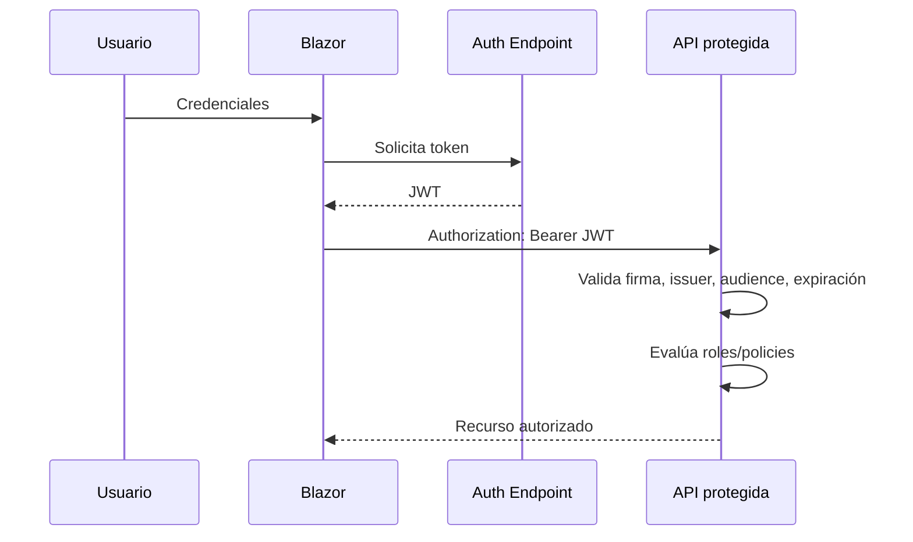

# Semana 7: Seguridad en el diseño: OAuth2 y JWT

## Enfoque de la semana

Diseñar autenticación y autorización en APIs .NET con JWT, claims, roles y políticas.


## 1. Mapa de aprendizaje

La seguridad no debe agregarse al final.  
Debe formar parte del diseño.

Esta semana estudia:

- Autenticación.
- Autorización.
- JWT.
- Claims.
- Roles.
- Policies.
- Riesgos comunes.
- Diseño seguro de endpoints.

---

## 2. Explicación conceptual detallada

### 2.1 Autenticación vs autorización

Autenticación responde:

> ¿Quién eres?

Autorización responde:

> ¿Qué puedes hacer?

Un usuario puede estar autenticado y aun así no tener permiso para publicar un curso.

### 2.2 JWT

JWT es un token firmado que transporta información en forma de claims.

Ejemplo de claims:

- `sub`: identificador del usuario.
- `email`: correo.
- `role`: rol.
- `exp`: expiración.
- `iss`: emisor.
- `aud`: audiencia.

El servidor valida:

- Firma.
- Emisor.
- Audiencia.
- Expiración.
- Algoritmo.
- Claims requeridos.

### 2.3 Bearer Token

El cliente envía el token en el header:

```http
Authorization: Bearer eyJhbGciOi...
```

El API no necesita guardar sesión en memoria.  
Esto permite APIs stateless, aunque introduce responsabilidad fuerte en protección del token.

### 2.4 Roles

Los roles agrupan permisos de alto nivel:

- Admin.
- Instructor.
- Student.

Son fáciles de entender, pero pueden volverse rígidos.

### 2.5 Policies

Las policies permiten reglas más expresivas.

Ejemplo:

```csharp
options.AddPolicy("InstructorOnly", policy =>
    policy.RequireRole("Instructor", "Admin"));
```

Luego:

```csharp
.RequireAuthorization("InstructorOnly")
```

### 2.6 OAuth2

OAuth2 es un framework de autorización.  
JWT puede ser el formato del access token, pero OAuth2 y JWT no son lo mismo.

En este módulo no se implementa un servidor OAuth2 completo.  
Se estudia el concepto y se implementa JWT local para entender la base.

En sistemas reales se recomienda usar proveedores como:

- Microsoft Entra ID.
- Auth0.
- Duende IdentityServer.
- Azure AD B2C.
- Cognito.
- Keycloak.

---

## 3. Diagrama mental



---

## 4. Reglas de diseño seguro

| Regla | Motivo |
|---|---|
| No guardar secretos en Git | Evita exposición |
| Usar expiración corta | Reduce impacto de robo |
| Validar issuer/audience | Evita tokens de otros sistemas |
| Usar HTTPS | Protege token en tránsito |
| No poner datos sensibles en JWT | JWT puede ser leído por el cliente |
| Autorizar por endpoint | No basta con autenticar |
| Registrar auditoría | Permite trazabilidad |

---

## 5. Errores comunes

- Confundir autenticación con autorización.
- Aceptar tokens sin validar issuer.
- Usar claves débiles.
- Guardar passwords en texto plano.
- Poner permisos críticos solo en frontend.
- Creer que ocultar botones en Blazor protege la API.
- No proteger endpoints de escritura.
- Usar tokens sin expiración.

---

## 6. Aplicación en .NET

ASP.NET Core permite configurar JWT Bearer Authentication.

La API valida tokens antes de permitir acceso a endpoints protegidos.

Ejemplo:

```csharp
app.UseAuthentication();
app.UseAuthorization();
```

Orden correcto:

1. Routing.
2. Authentication.
3. Authorization.
4. Endpoints.

---

## 7. Tarea desde cero

Crear seguridad para módulo de estudiantes:

- Endpoint público de login simulado.
- JWT con rol.
- Endpoint protegido para crear estudiante.
- Policy `AdminOrInstructor`.
- Endpoint solo Admin para desactivar estudiante.
- README explicando claims y riesgos.

---

## 8. Recursos adicionales

- Microsoft Learn — JWT Bearer Authentication.
- OWASP API Security Top 10.
- OAuth 2.0 RFC.
- JWT.io Introduction.
- Microsoft Identity Platform documentation.


---

## Checklist de estudio

- [ ] Comprendí los conceptos principales.
- [ ] Revisé los diagramas.
- [ ] Leí las plantillas de código.
- [ ] Puedo explicar la decisión arquitectónica.
- [ ] Puedo implementar una variante desde cero.
- [ ] Registré al menos una decisión en formato ADR.
