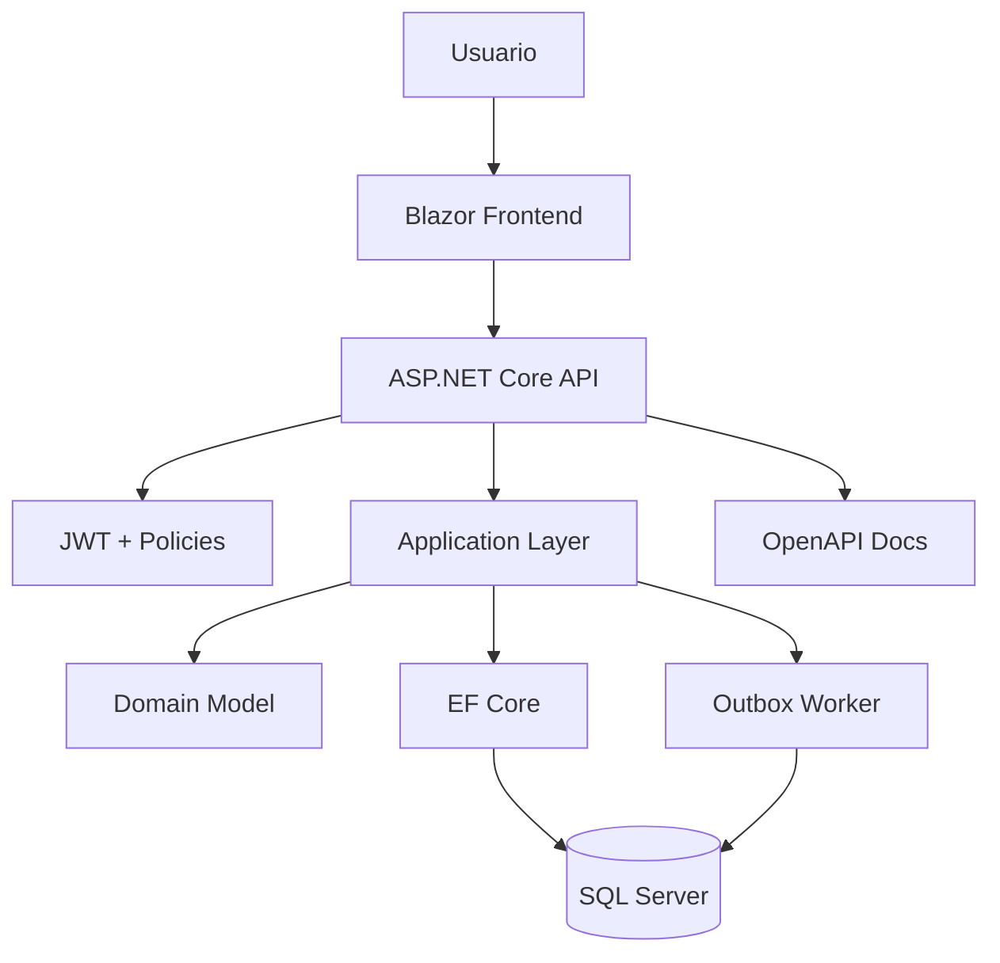

# Semana 8: Laboratorio integrador backend + frontend moderno

## Enfoque de la semana

Integrar lo aprendido en una aplicación .NET con API, Blazor, SQL Server, JWT, OpenAPI, Outbox y documentación.


## 1. Mapa de aprendizaje

La semana 8 consolida el módulo.

El estudiante debe demostrar que puede unir:

- Diseño limpio.
- Patrones.
- Monolito modular.
- API profesional.
- SQL Server.
- Outbox.
- JWT.
- Blazor.
- Documentación.

---

## 2. Explicación conceptual detallada

### 2.1 Qué significa integrar

Integrar no es juntar código.  
Integrar significa que las piezas colaboran respetando límites.

Una mala integración:

- Blazor accede directamente a SQL Server.
- El endpoint contiene toda la lógica.
- La entidad no protege reglas.
- Se envían notificaciones sin consistencia.
- La seguridad se aplica solo en la UI.
- No hay documentación de decisiones.

Una buena integración:

- Blazor consume API.
- API protege contratos y seguridad.
- Application ejecuta casos de uso.
- Domain protege reglas.
- EF Core persiste.
- SQL Server valida integridad.
- Outbox registra eventos.
- OpenAPI documenta.
- ADRs justifican decisiones.

---

## 3. Diagrama mental



---

## 4. Proyecto integrador: AcademyOps

AcademyOps es una plataforma académica simple.

Debe permitir:

- Administrar cursos.
- Administrar estudiantes.
- Matricular estudiantes.
- Publicar cursos.
- Registrar eventos Outbox.
- Mostrar datos desde Blazor.
- Proteger operaciones por rol.
- Documentar API.

---

## 5. Módulos mínimos

| Módulo | Responsabilidad |
|---|---|
| Courses | Crear, listar y publicar cursos |
| Students | Crear, listar y activar/desactivar estudiantes |
| Enrollments | Matricular estudiantes en cursos |
| Security | Login simulado y generación JWT |
| Notifications | Outbox para eventos internos |

---

## 6. Reglas de arquitectura obligatorias

1. No acceder a SQL Server desde Blazor.
2. No exponer entidades EF como respuesta HTTP.
3. Usar DTOs.
4. Usar al menos una policy de autorización.
5. Usar SQL Server con constraints.
6. Registrar al menos dos eventos Outbox.
7. Documentar endpoints con OpenAPI.
8. Crear al menos dos ADRs.
9. Incluir diagrama Mermaid.
10. Incluir README técnico.

---

## 7. Evaluación

| Criterio | Peso |
|---|---:|
| Arquitectura | 20% |
| API | 15% |
| Frontend Blazor | 15% |
| SQL Server | 15% |
| Seguridad | 10% |
| Outbox | 10% |
| Documentación | 10% |
| Calidad general | 5% |

---

## 8. Entrega esperada

```text
ProyectoIntegrador/
├── README.md
├── backend/
├── frontend/
├── database/
├── arquitectura/
│   ├── contexto.mmd
│   ├── contenedores.mmd
│   └── decisiones/
└── evidencias/
```

---

## 9. Recursos adicionales

- Microsoft Learn — ASP.NET Core.
- Microsoft Learn — Blazor.
- Microsoft Learn — EF Core SQL Server.
- Microsoft Learn — OpenAPI.
- Microsoft Learn — JWT Bearer.
- OWASP API Security.


---

## Checklist de estudio

- [ ] Comprendí los conceptos principales.
- [ ] Revisé los diagramas.
- [ ] Leí las plantillas de código.
- [ ] Puedo explicar la decisión arquitectónica.
- [ ] Puedo implementar una variante desde cero.
- [ ] Registré al menos una decisión en formato ADR.
