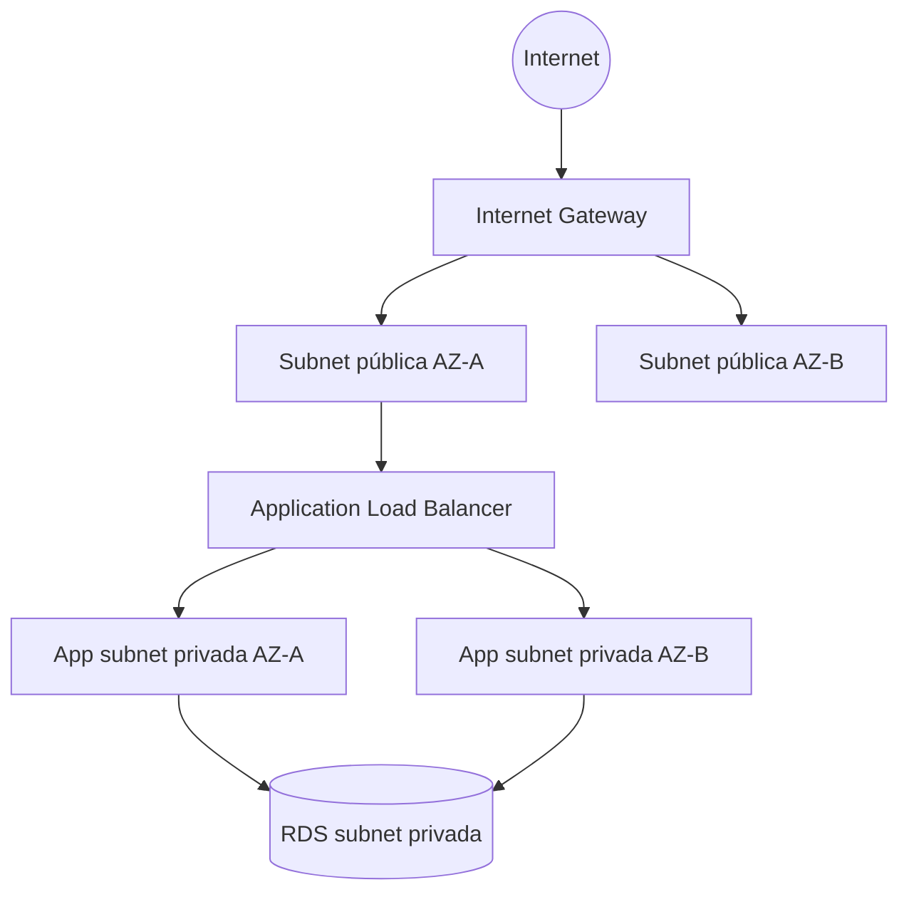

# Semana 9: Fundamentos de Nube: VPC, Regiones y Zonas de Disponibilidad

**Módulo:** 2  
**Bloque:** Redes y Cómputo en la Nube  
**Duración sincrónica:** 1h30  
**Carga total sugerida:** 7.5 horas semanales  
**Producto de la semana:** evidencia técnica en GitHub.

---

## 1. Resultado de aprendizaje

Al finalizar la semana, el estudiante será capaz de:

- Explicar regiones, zonas de disponibilidad y VPC.
- Diseñar una red básica con subredes públicas y privadas.
- Relacionar red cloud con seguridad y disponibilidad.

---

## 2. Contexto profesional


AWS organiza la infraestructura global en regiones y zonas de disponibilidad. Una región es un área geográfica independiente; una zona de disponibilidad es un conjunto de datacenters aislados dentro de una región. Diseñar para nube implica distribuir componentes para reducir puntos únicos de falla.

La VPC es la red privada donde viven recursos como EC2, RDS, balanceadores y endpoints. Una arquitectura típica separa subredes públicas para balanceadores o bastiones y subredes privadas para aplicaciones y bases de datos. Las tablas de rutas, gateways, security groups y NACLs definen cómo entra, sale y circula el tráfico.


---

## 3. Conceptos clave

- **Region**
- **Availability Zone**
- **VPC**
- **Subnet**
- **Route Table**
- **Internet Gateway**
- **Security Group**

---

## 4. Mapa visual del tema



---

## 5. Explicación detallada

### 5.1 Problema que resuelve el tema

En un entorno profesional, el valor de este tema aparece cuando el sistema necesita crecer sin perder control. El crecimiento puede ser técnico, como más tráfico, más módulos o más integraciones; o puede ser organizacional, como más personas modificando el código al mismo tiempo. Sin criterios de arquitectura, cada cambio aumenta el riesgo de romper funcionalidades existentes.

### 5.2 Decisión arquitectónica principal

La decisión central de esta semana consiste en identificar qué parte del sistema debe permanecer simple y qué parte necesita una estructura más formal. Una solución profesional no es la que usa más herramientas, sino la que reduce incertidumbre, facilita mantenimiento y permite operar el sistema con seguridad.

### 5.3 Señales de una mala implementación

- El código funciona, pero nadie puede explicar por qué está organizado de esa forma.
- Las responsabilidades están mezcladas entre interfaz, lógica, datos y seguridad.
- Los errores se ocultan o se manejan con respuestas genéricas.
- No existe documentación para ejecutar, probar o revisar la solución.
- La solución depende de pasos manuales que no están escritos.

### 5.4 Buenas prácticas esperadas

- Documentar las decisiones en el README.
- Mantener nombres claros y consistentes.
- Evitar secretos en código fuente.
- Usar Git con commits pequeños y descriptivos.
- Separar configuración por ambiente.
- Probar al menos el flujo principal.

---

## 6. Práctica técnica sugerida

Diseñar en diagrama una VPC para la aplicación .NET con subred pública, subred privada, ALB, EC2 y RDS.

### Evidencia mínima de práctica

El estudiante debe incluir en su repositorio:

```text
/semana-09
├── README.md
├── src/
├── diagrams/
└── evidencias/
```

El README de la práctica debe explicar:

- Qué problema se resolvió.
- Cómo se diseñó la solución.
- Qué decisiones se tomaron.
- Cómo se ejecuta.
- Qué se aprendió.

---

## 7. Tarea semanal desde cero

Crear un documento de diseño de red con CIDR, subredes, reglas de entrada/salida y justificación de seguridad.

### Criterios de aceptación

- Repositorio en GitHub con historial de commits.
- README técnico con diagrama Mermaid o imagen exportada.
- Código o documento ejecutable/revisable según la naturaleza de la semana.
- Evidencia de pruebas, ejecución, diseño o análisis.
- Enlace compartido en Classroom mientras se habilita el sistema propio.

---

## 8. Preguntas de repaso

1. ¿Qué problema real resuelve el tema de esta semana?
2. ¿Qué riesgo aparece si se aplica incorrectamente?
3. ¿Qué alternativa más simple existe?
4. ¿Qué indicador usaría para saber si la solución funciona bien?
5. ¿Cómo explicaría esta decisión a un líder técnico o arquitecto?

---

## 9. Recursos adicionales

- https://docs.aws.amazon.com/vpc/
- https://docs.aws.amazon.com/wellarchitected/latest/framework/welcome.html

---

## 10. Checklist de cierre

- [ ] Leí la teoría y entendí el mapa visual.
- [ ] Realicé la práctica o análisis sugerido.
- [ ] Documenté decisiones técnicas.
- [ ] Subí el trabajo a GitHub.
- [ ] Compartí el enlace en Classroom.
