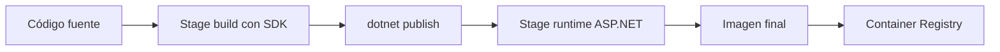

# Semana 17: Docker: creación y optimización de contenedores

**Módulo:** 3  
**Bloque:** Contenedores e Infraestructura como Código  
**Duración sincrónica:** 1h30  
**Carga total sugerida:** 7.5 horas semanales  
**Producto de la semana:** evidencia técnica en GitHub.

---

## 1. Resultado de aprendizaje

Al finalizar la semana, el estudiante será capaz de:

- Construir imágenes Docker para API y Web.
- Aplicar buenas prácticas de Dockerfile.
- Separar build, runtime y configuración.

---

## 2. Contexto profesional


Un contenedor empaqueta una aplicación y sus dependencias de ejecución. Docker no reemplaza la arquitectura de software; la hace más portable. Una mala aplicación en contenedor sigue siendo una mala aplicación, pero ahora se despliega más rápido.

Las imágenes deben ser pequeñas, reproducibles y seguras. Multi-stage build permite compilar con SDK y ejecutar con runtime más liviano. La configuración no debe quedar quemada en la imagen; debe inyectarse por variables de entorno o mecanismos de secretos.


---

## 3. Conceptos clave

- **Container**
- **Image**
- **Dockerfile**
- **Layer**
- **Multi-stage build**
- **Registry**

---

## 4. Mapa visual del tema



---

## 5. Explicación detallada

### 5.1 Problema que resuelve el tema

En un entorno profesional, el valor de este tema aparece cuando el sistema necesita crecer sin perder control. El crecimiento puede ser técnico, como más tráfico, más módulos o más integraciones; o puede ser organizacional, como más personas modificando el código al mismo tiempo. Sin criterios de arquitectura, cada cambio aumenta el riesgo de romper funcionalidades existentes.

### 5.2 Decisión arquitectónica principal

La decisión central de esta semana consiste en identificar qué parte del sistema debe permanecer simple y qué parte necesita una estructura más formal. Una solución profesional no es la que usa más herramientas, sino la que reduce incertidumbre, facilita mantenimiento y permite operar el sistema con seguridad.

### 5.3 Señales de una mala implementación

- El código funciona, pero nadie puede explicar por qué está organizado de esa forma.
- Las responsabilidades están mezcladas entre interfaz, lógica, datos y seguridad.
- Los errores se ocultan o se manejan con respuestas genéricas.
- No existe documentación para ejecutar, probar o revisar la solución.
- La solución depende de pasos manuales que no están escritos.

### 5.4 Buenas prácticas esperadas

- Documentar las decisiones en el README.
- Mantener nombres claros y consistentes.
- Evitar secretos en código fuente.
- Usar Git con commits pequeños y descriptivos.
- Separar configuración por ambiente.
- Probar al menos el flujo principal.

---

## 6. Práctica técnica sugerida

Crear Dockerfile multi-stage para la API y ejecutar contenedor con cadena de conexión externa.

### Evidencia mínima de práctica

El estudiante debe incluir en su repositorio:

```text
/semana-17
├── README.md
├── src/
├── diagrams/
└── evidencias/
```

El README de la práctica debe explicar:

- Qué problema se resolvió.
- Cómo se diseñó la solución.
- Qué decisiones se tomaron.
- Cómo se ejecuta.
- Qué se aprendió.

---

## 7. Tarea semanal desde cero

Contenerizar API y Blazor. Documentar tamaño de imagen, variables de entorno y comandos de ejecución.

### Criterios de aceptación

- Repositorio en GitHub con historial de commits.
- README técnico con diagrama Mermaid o imagen exportada.
- Código o documento ejecutable/revisable según la naturaleza de la semana.
- Evidencia de pruebas, ejecución, diseño o análisis.
- Enlace compartido en Classroom mientras se habilita el sistema propio.

---

## 8. Preguntas de repaso

1. ¿Qué problema real resuelve el tema de esta semana?
2. ¿Qué riesgo aparece si se aplica incorrectamente?
3. ¿Qué alternativa más simple existe?
4. ¿Qué indicador usaría para saber si la solución funciona bien?
5. ¿Cómo explicaría esta decisión a un líder técnico o arquitecto?

---

## 9. Recursos adicionales

- https://docs.docker.com/build/building/best-practices/
- https://learn.microsoft.com/dotnet/core/docker/build-container

---

## 10. Checklist de cierre

- [ ] Leí la teoría y entendí el mapa visual.
- [ ] Realicé la práctica o análisis sugerido.
- [ ] Documenté decisiones técnicas.
- [ ] Subí el trabajo a GitHub.
- [ ] Compartí el enlace en Classroom.
