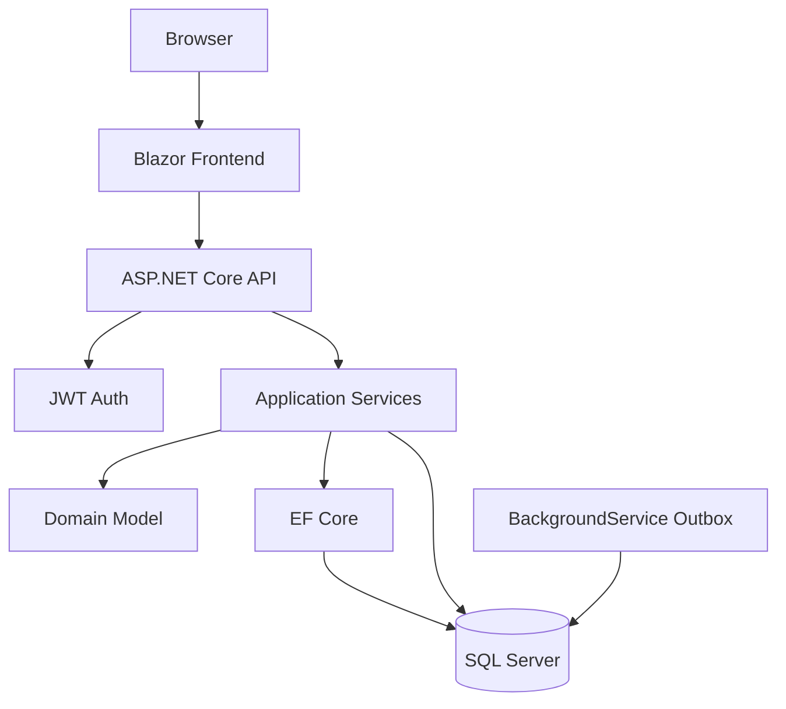

# Proyecto Integrador — AcademyOps

## Propósito

AcademyOps es el proyecto final del Módulo 1.  
Debe demostrar dominio de arquitectura de software con .NET y SQL Server.

---

## Stack obligatorio

| Área | Tecnología |
|---|---|
| Backend | ASP.NET Core |
| Frontend | Blazor |
| Base de datos | SQL Server |
| ORM | EF Core |
| Seguridad | JWT |
| Documentación | OpenAPI / Swagger |
| Mensajería interna | Outbox Pattern con SQL Server |

---

## Funcionalidades mínimas

### Cursos

- Crear curso.
- Listar cursos.
- Publicar curso.
- Evitar código duplicado.

### Estudiantes

- Crear estudiante.
- Listar estudiantes.
- Activar/desactivar estudiante.
- Validar email único.

### Matrículas

- Matricular estudiante en curso.
- Evitar matrícula duplicada.
- Consultar cursos de un estudiante.

### Seguridad

- Login simulado.
- Roles:
  - Admin.
  - Instructor.
  - Student.
- Policies:
  - AdminOnly.
  - InstructorOnly.
  - StudentReadAccess.

### Outbox

Registrar eventos:

- CourseCreated.
- StudentRegistered.
- StudentEnrolled.

---

## Arquitectura esperada



---

## Estructura sugerida

```text
AcademyOps/
├── backend/
│   └── AcademyOps.Api/
├── frontend/
│   └── AcademyOps.Blazor/
├── database/
│   ├── schema.sql
│   └── seed.sql
└── arquitectura/
    ├── contexto.mmd
    ├── contenedores.mmd
    └── decisiones/
```

---

## ADRs obligatorios

1. Por qué se usa monolito modular.
2. Por qué se usa SQL Server.
3. Por qué se usa Outbox en SQL Server y no RabbitMQ/Kafka.
4. Por qué se usa Blazor en lugar de React/Angular.
5. Por qué JWT es suficiente para el módulo, pero no reemplaza un proveedor OAuth2 real.

---

## Entrega final

La entrega debe incluir:

- Código fuente.
- Scripts SQL.
- README técnico.
- Diagramas.
- ADRs.
- Evidencias de ejecución.
- Lista de pendientes técnicos.
- Reflexión final.

---

## Criterio de éxito

El proyecto no se evalúa solo por funcionar.  
Se evalúa por demostrar que el estudiante entiende por qué tomó cada decisión.
