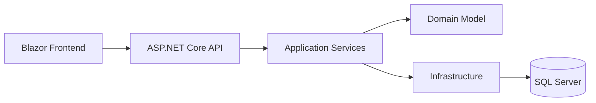

# Certificación Profesional en Arquitectura de Software y Cloud Ops

## Módulo 1 — Arquitectura de Software y Patrones con .NET + SQL Server

Este repositorio contiene el material completo de los primeros 2 meses del curso: **8 semanas**, equivalentes al primer módulo formal de la certificación.

La versión actual fue diseñada con una regla práctica:

> El estudiante debe poder aprender arquitectura de software usando principalmente **.NET, ASP.NET Core, Blazor y SQL Server**, sin depender de herramientas adicionales como brokers externos, frontend JavaScript, plataformas cloud obligatorias o motores de base de datos separados.

El repositorio está orientado a lectura, estudio, práctica guiada y evaluación, en un estilo similar a un repositorio académico tipo **AWS Academy**: primero se explica el concepto, luego se muestra cómo se aplica, después se entrega una práctica de refuerzo y finalmente se propone una tarea independiente.

---

## 1. Objetivo del curso

Al finalizar este módulo, el estudiante será capaz de:

- Diseñar aplicaciones web profesionales aplicando principios SOLID y Clean Code.
- Reconocer y aplicar patrones de diseño creacionales, estructurales y de comunicación.
- Diferenciar arquitectura monolítica, monolito modular y microservicios.
- Diseñar APIs limpias, documentadas y mantenibles con ASP.NET Core y OpenAPI/Swagger.
- Implementar comunicación asíncrona sin depender inicialmente de brokers externos.
- Modelar datos relacionales en SQL Server y comprender cuándo aparece una necesidad NoSQL.
- Diseñar autenticación y autorización con JWT desde una visión arquitectónica.
- Construir un backend y frontend moderno usando únicamente .NET y SQL Server.

---

## 2. Herramientas oficiales del módulo

### Herramientas principales

| Área | Herramienta |
|---|---|
| Lenguaje | C# |
| Framework backend | ASP.NET Core |
| Frontend | Blazor |
| ORM | Entity Framework Core |
| Base de datos principal | SQL Server / SQL Server Express LocalDB |
| Documentación API | OpenAPI / Swagger UI |
| Seguridad | JWT Bearer Authentication |
| Comunicación asíncrona | SQL Server Outbox + BackgroundService |
| Tiempo real opcional | SignalR |
| IDE sugerido | Visual Studio 2022/2026 o Visual Studio Code |

### Regla pedagógica

Durante este módulo se evita introducir herramientas que distraigan del objetivo principal.  
Por eso:

- No se usa React, Angular ni Vue.
- No se usa Node.js.
- No se usa RabbitMQ, Kafka ni Azure Service Bus en el laboratorio principal.
- No se exige Docker.
- No se exige cloud.
- No se exige MongoDB ni Cosmos DB para el desarrollo principal.

La semana de **SQL vs NoSQL** explica NoSQL desde arquitectura y permite una práctica controlada usando JSON en SQL Server. También incluye una sección opcional para discutir cómo sería una base NoSQL real, sin convertirla en dependencia del módulo.

---

## 3. Duración y modalidad

| Elemento | Detalle |
|---|---|
| Duración total del curso completo | 6 meses |
| Sesiones sincrónicas totales | 24 |
| Duración por sesión | 1h30 |
| Este repositorio cubre | Primeros 2 meses / 8 semanas |
| Enfoque | Arquitectura, diseño, patrones y fundamentos Cloud Ops |
| Modalidad | Lectura académica + práctica de refuerzo + tarea independiente |

---

## 4. Cronograma del Módulo 1

| Semana | Tema | Resultado esperado |
|---|---|---|
| Semana 1 | Principios SOLID y Clean Code aplicados a entornos web | Diseñar servicios, controladores y entidades con bajo acoplamiento |
| Semana 2 | Patrones de diseño esenciales | Aplicar Factory, Strategy, Adapter, Decorator y Facade en .NET |
| Semana 3 | Arquitectura monolítica vs microservicios | Decidir cuándo usar monolito, monolito modular o microservicios |
| Semana 4 | Diseño y documentación de APIs profesionales | Diseñar endpoints, contratos, errores y documentación OpenAPI |
| Semana 5 | Comunicación asíncrona y patrones de mensajería | Implementar Outbox Pattern con SQL Server y BackgroundService |
| Semana 6 | Estrategias de bases de datos: SQL vs NoSQL | Modelar datos relacionales y documentales de forma razonada |
| Semana 7 | Seguridad en el diseño: OAuth2 y JWT | Diseñar autenticación, autorización, claims, roles y políticas |
| Semana 8 | Laboratorio integrador backend + frontend moderno | Integrar API, SQL Server, Blazor, JWT, Outbox y documentación |

---

## 5. Estructura del repositorio

```text
Certificacion-Arquitectura-Software-CloudOps-DotNet-SqlServer-Modulo1/
│
├── README.md
├── docs/
│   ├── 00-guia-del-estudiante.md
│   ├── 01-entorno-unico-dotnet-sqlserver.md
│   ├── 02-arquitectura-referencia.md
│   ├── 03-glosario-arquitectura.md
│   ├── 04-rubrica-evaluacion.md
│   └── adr-template.md
│
├── src/
│   ├── README.md
│   ├── Directory.Build.props
│   ├── ArchitectureAcademy.Api/
│   ├── ArchitectureAcademy.Frontend/
│   ├── ArchitectureAcademy.SharedKernel/
│   └── Database/
│
├── Modulo1/
│   ├── Semana1/
│   ├── Semana2/
│   ├── Semana3/
│   ├── Semana4/
│   ├── Semana5/
│   ├── Semana6/
│   ├── Semana7/
│   └── Semana8/
│
└── ProyectoIntegrador/
    ├── README.md
    ├── arquitectura/
    ├── backend/
    ├── frontend/
    └── database/
```

---

## 6. Cómo estudiar cada semana

Cada semana tiene un `README.md` con esta estructura:

1. **Mapa de aprendizaje**
2. **Explicación conceptual detallada**
3. **Diagramas Mermaid**
4. **Aplicación en .NET + SQL Server**
5. **Plantillas de código**
6. **Errores comunes**
7. **Tarea desde cero**
8. **Criterios de evaluación**
9. **Recursos adicionales**

La idea no es copiar comandos mecánicamente. La idea es que el estudiante entienda por qué existe cada decisión arquitectónica.

---

## 7. Ruta de instalación sugerida

Directorio solicitado:

```powershell
D:\Personal\Cursos\Arquitectura de Software y Cloud Ops
```

Para extraer este repositorio:

```powershell
Expand-Archive -Path .\Certificacion-Arquitectura-Software-CloudOps-DotNet-SqlServer-Modulo1.zip -DestinationPath "D:\Personal\Cursos\Arquitectura de Software y Cloud Ops"
```

---

## 8. Convención de arquitectura usada

Durante el módulo se trabaja con una arquitectura progresiva:



La aplicación se entiende como capas de responsabilidad:

| Capa | Responsabilidad |
|---|---|
| Frontend | Presentación, formularios, validaciones de experiencia de usuario |
| API | Contratos HTTP, autenticación, autorización, documentación |
| Application | Casos de uso, orquestación, transacciones |
| Domain | Reglas de negocio, entidades, invariantes |
| Infrastructure | Persistencia, SQL Server, integración externa |
| Database | Datos, restricciones, índices, trazabilidad |

---

## 9. Proyecto integrador del módulo

Al finalizar la semana 8, el estudiante construye una plataforma llamada:

# AcademyOps

Una aplicación académica sencilla para administrar cursos, estudiantes, matrículas, tareas y notificaciones internas.

Debe incluir:

- Backend ASP.NET Core.
- Frontend Blazor.
- SQL Server.
- Entity Framework Core.
- OpenAPI/Swagger.
- JWT.
- Roles.
- Outbox Pattern.
- Auditoría básica.
- Decisiones arquitectónicas documentadas.
- Diagramas.
- README técnico.

---

## 10. Nota sobre .NET y versiones

El material está preparado para `net10.0` por ser una versión LTS moderna.  
Si el estudiante usa una versión anterior, puede ajustar los archivos `.csproj` a `net8.0`, siempre que tenga el SDK correspondiente instalado.
