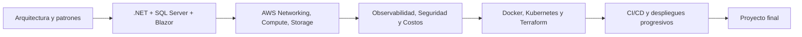

# Certificación Profesional en Arquitectura de Software y Cloud Ops

Repositorio académico completo para impartir y estudiar la certificación durante 6 meses. El diseño del material está inspirado en una experiencia tipo academia: teoría estructurada, lecturas técnicas, diagramas, laboratorios de referencia, evidencias, autoevaluaciones y proyecto integrador.

> Repositorio oficial del curso: https://github.com/johans08/Curso-Arquitectura-de-Software-y-CloudOps

## 1. Descripción general

La certificación prepara al estudiante para diseñar, construir, desplegar, monitorear y automatizar soluciones modernas utilizando arquitectura de software, servicios de nube AWS y prácticas DevOps. El hilo conductor del curso es una aplicación de referencia desarrollada principalmente con **.NET, Blazor y SQL Server**, que luego se despliega y automatiza progresivamente.

## 2. Duración y carga académica

- Duración total: **6 meses**.
- Sesiones sincrónicas: **24 sesiones de 1h30**.
- Horas sincrónicas: **36 horas**.
- Carga total de aprovechamiento: **180 horas**.
- Dedicación sugerida: **7.5 horas semanales** entre clase, lectura, práctica técnica y entregables.

## 3. Modalidad de uso del repositorio

Cada semana contiene material para tres momentos:

1. **Estudio previo o posterior:** explicación conceptual detallada, diagramas, vocabulario técnico y decisiones de arquitectura.
2. **Práctica técnica:** laboratorio de referencia, plantillas y retos para aplicar el tema.
3. **Evidencia evaluable:** tarea semanal que debe subirse a GitHub y registrarse según las instrucciones del instructor.

## 4. Entregas y GitHub

Todo estudiante debe crear una cuenta en GitHub. Las tareas se desarrollan en repositorios propios del estudiante. Mientras el sistema propio de evaluación no esté disponible, el estudiante debe subir el enlace de su repositorio o pull request en Classroom.

Formato recomendado de entrega semanal:

```text
Nombre completo:
Semana:
Repositorio GitHub:
Rama o Pull Request:
Resumen de lo implementado:
Decisiones técnicas tomadas:
Evidencia de ejecución:
```

## 5. Enlace de clases

El enlace de clases no cambia durante el curso:

- Google Meet: https://meet.google.com/qms-iube-vak
- Zona horaria: America/Costa_Rica
- Horario base informado: viernes de 7:00 p.m. a 8:30 p.m.

## 6. Estructura del repositorio

```text
.
├── README.md
├── docs/
├── database/
├── src/
│   └── ReferenceArchitecture/
├── infrastructure/
├── Modulo1-Arquitectura-Software-Patrones/
├── Modulo2-Cloud-Infrastructure-AWS/
├── Modulo3-DevOps-Automatizacion/
└── Evaluaciones/
```

## 7. Cronograma general

| Módulo | Meses | Enfoque | Semanas |
|---|---:|---|---:|
| Módulo 1 | 1 y 2 | Arquitectura de Software y Patrones | 1-8 |
| Módulo 2 | 3 y 4 | Cloud Infrastructure & AWS | 9-16 |
| Módulo 3 | 5 y 6 | DevOps & Automatización | 17-24 |

## 8. Sistema de evaluación

| Componente | Descripción | Ponderación |
|---|---|---:|
| Prácticas semanales | Ejercicios técnicos de código y nube realizados tras cada clase. | 40% |
| Examen modular | Una prueba técnica al finalizar cada módulo. | 30% |
| Proyecto integrador | Caso real de una infraestructura Cloud completa y automatizada. | 30% |
| Total |  | 100% |

## 9. Ruta de aprendizaje



## 10. Requisitos técnicos sugeridos

### Base local para los primeros módulos

- Cuenta en GitHub.
- .NET SDK 8 o superior.
- Visual Studio 2022, Visual Studio Code o JetBrains Rider.
- SQL Server Developer Edition, SQL Server Express o LocalDB.
- Navegador web moderno.

### Para los módulos de nube y DevOps

- Cuenta AWS Academy, AWS Educate o cuenta personal con control de presupuesto.
- AWS CLI.
- Docker Desktop o alternativa compatible.
- Terraform.
- GitHub Actions habilitado en el repositorio del estudiante.

## 11. Aplicación de referencia

La carpeta `src/ReferenceArchitecture` contiene una aplicación base para trabajar los conceptos del curso:

- API REST con ASP.NET Core.
- Frontend con Blazor.
- Persistencia con SQL Server y Entity Framework Core.
- Patrón Outbox para comunicación asíncrona sin requerir un broker externo en los primeros módulos.
- Estructura por capas para practicar arquitectura limpia.

## 12. Recomendación para instructores

Este repositorio puede usarse de dos maneras:

1. Como **libro técnico del curso**, leyendo cada README semanal antes de la sesión.
2. Como **base de laboratorio**, donde el estudiante implementa progresivamente la solución y documenta decisiones en GitHub.

## 13. Libro académico del curso

Para una lectura más continua, revise `docs/07_Libro_academico_del_curso.md`. Este archivo resume el razonamiento técnico de las 24 semanas con un enfoque más conceptual y menos dependiente de instrucciones paso a paso.

