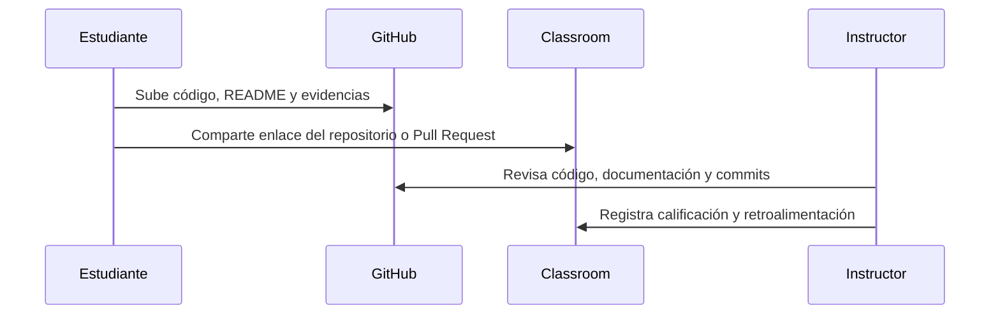

# GitHub, tareas y evaluaciones

## Repositorio oficial del curso

https://github.com/johans08/Curso-Arquitectura-de-Software-y-CloudOps

## Cuenta obligatoria

Cada estudiante debe crear una cuenta en GitHub. La cuenta será necesaria para:

- Descargar material del curso.
- Subir tareas semanales.
- Documentar decisiones técnicas.
- Recibir retroalimentación.
- Presentar el proyecto final.

## Proceso de entrega temporal

Mientras se habilita el sistema propio del instructor, el flujo será:

## Reglas mínimas de entrega

- No se reciben archivos comprimidos como evidencia principal.
- El enlace debe apuntar a un repositorio público o compartido con el instructor.
- Cada tarea debe tener commits claros.
- Cada README debe explicar cómo ejecutar la solución.
- Las tareas deben subirse a GitHub; Classroom solo recibirá el enlace.

## Evaluaciones

Las evaluaciones se realizarán con base en:

- Código funcional.
- Documentación técnica.
- Calidad de arquitectura.
- Seguridad básica.
- Evidencia de pruebas.
- Claridad del historial de commits.
