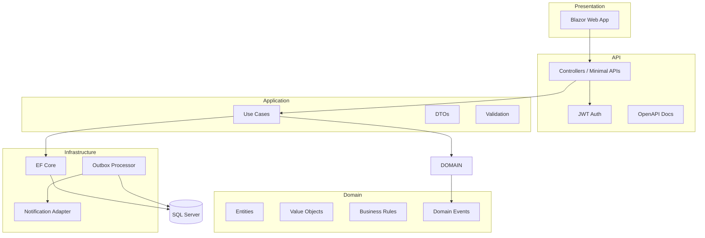
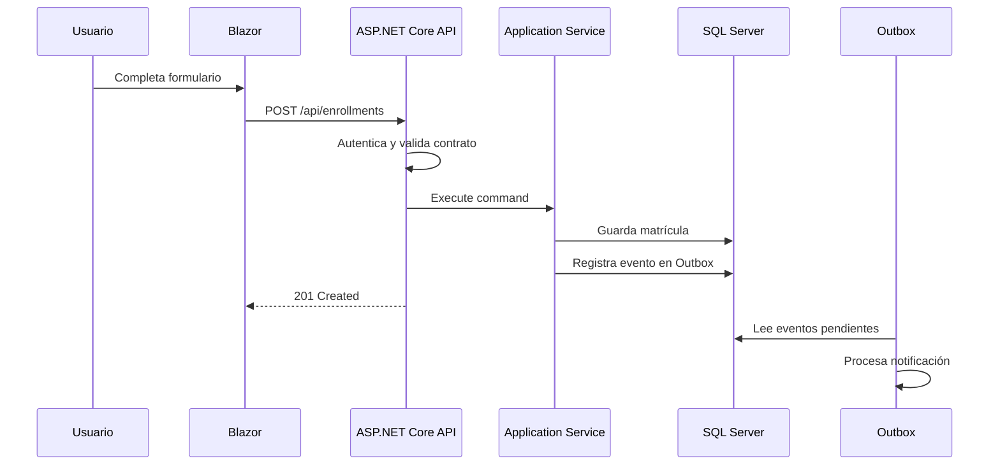

# Arquitectura de referencia del módulo

## Vista general

---

## Principios de diseño

### 1. La interfaz no debe conocer la base de datos

Blazor debe consumir la API o servicios de aplicación.  
No debe construir SQL ni depender de EF Core directamente en una arquitectura separada.

### 2. La API no debe contener lógica de negocio compleja

La API debe:

- Recibir requests.
- Validar estructura básica.
- Autenticar.
- Autorizar.
- Delegar casos de uso.
- Responder con contratos claros.

### 3. La lógica importante vive en Application y Domain

La capa de aplicación coordina operaciones.  
El dominio protege reglas que no deben romperse.

### 4. SQL Server debe proteger integridad

Una base profesional no depende solo del código. Debe tener:

- Llaves primarias.
- Llaves foráneas.
- Índices.
- Constraints.
- Tipos adecuados.
- Campos de auditoría.
- Estrategia de migraciones.

---

## Flujo típico de un caso de uso

---

## Decisiones importantes

| Decisión | Razón |
|---|---|
| Usar SQL Server como motor principal | Reduce complejidad y fortalece modelado relacional |
| Usar Blazor como frontend | Mantiene todo el stack en .NET |
| Usar Outbox con SQL Server | Enseña mensajería sin introducir RabbitMQ/Kafka |
| Usar JWT | Permite entender APIs stateless |
| Usar OpenAPI | Formaliza contratos de integración |
| Usar ADRs | Enseña documentación de decisiones reales |
